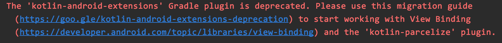

在 Android 开发中一切都向着更便捷、更安全的方向发展。长久以来 Android 开发者都在想办法解决重复编写`findViewById` 的问题。 虽然有一些类似`JakeWharton`大佬开源的[`ButterKnife`](https://github.com/JakeWharton/butterknife) 之类的库缓解了这一问题，但是这些库或多或少的还是需要编写一些代码以完成控件与 id 之间的绑定。并不是终极方案。


# kotlin-android-extensions

在 Google 大力推广 Kotlin 之后 `kotlin-android-extensions` 插件的出现让广大 Android 开发者看到了希望。大家直呼这才是我想要的！Google 也将`kotlin-android-extensions` 设置为 `Android Studio` 的默认插件。它可以完全屏蔽`findViewById`，开发者可以直接使用 `xml`布局文件中的 `id`来操作对应的控件。

```xml
<androidx.constraintlayout.widget.ConstraintLayout >
    <TextView android:id="@+id/tvHello" />
</androidx.constraintlayout.widget.ConstraintLayout>
```

例如在布局文件中有一个名为`tvHello`的`TextView`，我们可以在`Activity`中使用如下代码对此`TextView`进行操作。

```kotlin
import kotlinx.android.synthetic.main.activity_main.*

override fun onCreate(savedInstanceState: Bundle?) {
    super.onCreate(savedInstanceState)
    setContentView(R.layout.activity_main)

    tvHello.text = "Hello World!"
}
```

没错，就是这么简单。那它是怎么做到的呢？通过 `Android Studio > Toos > Kotlin > ShowKotlin Bytecode` 查看反编译后的`Java`代码：

```java
public final class MainActivity extends AppCompatActivity {
   private HashMap _$_findViewCache;

   protected void onCreate(@Nullable Bundle savedInstanceState) {
      super.onCreate(savedInstanceState);
      this.setContentView(1300083);
      TextView var10000 = (TextView)this._$_findCachedViewById(id.tvHello);
      Intrinsics.checkNotNullExpressionValue(var10000, "tvHello");
      var10000.setText((CharSequence)"Hello World!");
   }

   public View _$_findCachedViewById(int var1) {
      if (this._$_findViewCache == null) {
         this._$_findViewCache = new HashMap();
      }

      View var2 = (View)this._$_findViewCache.get(var1);
      if (var2 == null) {
         var2 = this.findViewById(var1);
         this._$_findViewCache.put(var1, var2);
      }

      return var2;
   }

   public void _$_clearFindViewByIdCache() {
      if (this._$_findViewCache != null) {
         this._$_findViewCache.clear();
      }

   }
}
```

可以看出`kotlin-android-extensions`插件自动生成了`_$_findCachedViewById`函数，首先在`_$_findViewCache` 中通过`id`查找是否已经存在，如果不存在则调用`findViewById`进行初始化。


一切看起来那么美好，直到某天升级` Android Studio` 之后，在`Build`信息中看到`kotlin-android-extensions`被废弃了。。。




真不敢相信自己的眼睛，但这就是事实。


实际上`kotlin-android-extensions`确实存在很多问题，例如只能在 `Kotlin`中使用，而不能再`Java`中使用、在`Fragment`、`Adapter`中很容易写出错误的代码导致程序存在安全隐患或者性能问题。至于到底为什么被废弃我们就没必要追究了，还是来看看新的产物吧。


# Activity 中使用 ViewBinding

可以看出建议使用`Jetpack`中的 `ViewBinding` 来替代`kotlin-android-extensions`。如果要使用` ViewBinding`则需要在对应`module`的`build.gradle`中做如下配置：

```gradle
android {
    ...
    buildFeatures {
        viewBinding true
    }
}
```

这样`ViewBinding`就被启用了，`ViewBinding`支持模块级别开启。

之后系统会自动地为每一个`xml`布局文件生成一个对应的类，其名字是将`xml`名字转换为驼峰命名并以`Binding`结尾，例如`activity_maint.xml`则会生成一个`ActivityMainBinding.java`的类与之对应。如果某个`xml`不想生成`java`文件则可以将`tools:viewBindingIgnore="true"` 属性添加到相应布局文件的根视图中。这样系统就会忽略这个布局文件了。


在来看看在代码中如何使用`ViewBinding`。

```java
class MainActivity : AppCompatActivity() {
    
    private lateinit var binding: ActivityMainBinding
    
    override fun onCreate(savedInstanceState: Bundle?) {
        super.onCreate(savedInstanceState)
        binding = ActivityMainBinding.inflate(layoutInflater)
        setContentView(binding.root)

        binding.tvHello.text = "Hello World!"
    }
}
```


1. 调用`ActivityMainBinding`的`inflate`方法创建实例。
2. 调用`ActivityMainBinding`的 `getRoot()`方法获取根布局，并传给`setContentView()`。
3. 使用`binding`实例获取布局中的控件，并进行相关操作。


我们看看生成的`ActivityMainBinding`是如何实现的，其文件存储在`moduleName/build/generated/data_binding_base_class_source_out`路径中。

还用上面的`activity_main.xml`为例，生成的`ActivityMainBinding.java`文件如下：

```java

public final class ActivityMainBinding implements ViewBinding {
  @NonNull
  private final ConstraintLayout rootView;

  @NonNull
  public final TextView tvHello;

  private ActivityMainBinding(@NonNull ConstraintLayout rootView, @NonNull TextView tvHello) {
    this.rootView = rootView;
    this.tvHello = tvHello;
  }

  // 布局的根 View
  @Override
  @NonNull
  public ConstraintLayout getRoot() {
    return rootView;
  }

  // 一个参数的 inflate 通常在 activity 中使用。
  @NonNull
  public static ActivityMainBinding inflate(@NonNull LayoutInflater inflater) {
    return inflate(inflater, null, false);
  }

  // 三个参数的 inflate 通常在 fragment 和 adapter 中使用。
  @NonNull
  public static ActivityMainBinding inflate(@NonNull LayoutInflater inflater,
      @Nullable ViewGroup parent, boolean attachToParent) {
    View root = inflater.inflate(R.layout.activity_main, parent, false);
    if (attachToParent) {
      parent.addView(root);
    }
    return bind(root);
  }

  @NonNull
  public static ActivityMainBinding bind(@NonNull View rootView) {
    // The body of this method is generated in a way you would not otherwise write.
    // This is done to optimize the compiled bytecode for size and performance.
    int id;
    missingId: {
      id = R.id.tvHello;
      TextView tvHello = rootView.findViewById(id);
      if (tvHello == null) {
        break missingId;
      }

      return new ActivityMainBinding((ConstraintLayout) rootView, tvHello);
    }
    String missingId = rootView.getResources().getResourceName(id);
    throw new NullPointerException("Missing required view with ID: ".concat(missingId));
  }
}
```

- 在`ActivityMainBinding`中会对布局的根`View`持有引用，并且布局中所有带`id`的 `View`都会持有引用，并且保证不为空。如果布局中某个 `View`没有显示设置 `id`则不会在`Binding`类中持有引用。
- `Binding`中有两个重载的`inflate`方法，其中一个参数的`inflate`方法通常在 `Activity`中使用，三个参数的`inflate`方法通常在`Fragment`和`Adapter`中使用。两者最终都通过`bind`方法来创建`Binding`实例。


生成的`Binding`类代码并不复杂，接下来我们再来看看其他场景中如何使用`ViewBinding`。


# Fragment 中使用 ViewBinding

与 `Activity` 中使用 `ViewBinding` 类似，只不过因为 `Fragment`的声明周期比较特殊，所以需要一些额外的处理。

```kotlin
private var _binding: ResultProfileBinding? = null
// This property is only valid between onCreateView and onDestroyView.
private val binding get() = _binding!!

override fun onCreateView(inflater: LayoutInflater, container: ViewGroup?, savedInstanceState: Bundle?): View? {
    _binding = ResultProfileBinding.inflate(inflater, container, false)
    val view = binding.root
    return view
}

override fun onDestroyView() {
    super.onDestroyView()
    _binding = null
}
```


1. 这里使用一个可空的`_binding`来持有`Binding`的实例，并在`onDestroyView()`中清楚对`Binding`实例的引用。因为有可能 `Fragment`的视图已经销毁但是`Fragment`的实例还存在。
2. 在 `Fragment`的`onCreateView`中调用`Binding`类中三个参数的`inflate`方法进行实例化。
3. 创建一个不为空的`binding`变量，并使其`get()`方法直接返回`_bingding!!`，这个变量就是保证我们后续调用视图引用时保证不为空，使用更便捷。
4. 后续的使用就和 `Activity`一样了，直接使用`binding`变量即可调用所有的视图引用。例如：`binding.tvHello.text = "Hello World!"`。


# Adapter 中使用 ViewBinding

在编写`RecyclerView.Adapter`时通常会在其内部创建一个`ViewHolder`内部类，这样可以避免视图销毁重建的过程中重复调用`findViewById`。


```kotlin
class ViewBindingDemoAdapter: RecyclerView.Adapter<ViewBindingDemoAdapter.ViewHolder>() {

    private val data = mutableListOf("Lifecycle", "LiveData", "ViewModel", "Room", "WorkManager")

    override fun onCreateViewHolder(parent: ViewGroup, viewType: Int): ViewHolder {
        val view = LayoutInflater.from(parent.context).inflate(R.layout.item_view_binding_demo, parent, false)
        return ViewHolder(view)
    }

    override fun onBindViewHolder(holder: ViewHolder, position: Int) {
        holder.tvName.text = data[position]
    }

    override fun getItemCount(): Int = data.size

    inner class ViewHolder(itemView: View) : RecyclerView.ViewHolder(itemView) {
        val tvName: TextView = itemView.findViewById(R.id.tvName)
    }
}
```


上面的写法很普遍，可以看到`ViewHolder `中使用`findViewById`进行视图绑定，这样的模板代码枯燥乏味，还不得不写。在使用`ViewBinding`之后我们进行改造。

```kotlin
class ViewBindingDemoAdapter: RecyclerView.Adapter<ViewBindingDemoAdapter.ViewHolder>() {

    private val data = mutableListOf("Lifecycle", "LiveData", "ViewModel", "Room", "WorkManager")

    override fun onCreateViewHolder(parent: ViewGroup, viewType: Int): ViewHolder {
        val binding = ItemViewBindingDemoBinding.inflate(LayoutInflater.from(parent.context), parent, false)
        return ViewHolder(binding)
    }

    override fun onBindViewHolder(holder: ViewHolder, position: Int) {
        holder.tvName.text = data[position]
    }

    override fun getItemCount(): Int = data.size

    inner class ViewHolder(binding: ItemViewBindingDemoBinding) : RecyclerView.ViewHolder(binding.root) {
        val tvName: TextView = binding.tvName
    }
}
```

在`onCreateViewHolder`中使用`Binding`类三个参数的`inflate`方法进行实例化，并且` ViewHolder`的构造方法中改成以`Binding`类为参数。这样在` ViewHolder`中就可以直接使用 `Binding`类进行实例化了。


还有一种方式就是将` ViewHolder`构造方法中的参数改成成员变量，这样就可以省去在` ViewHolder`内部创建其它变量的过程了，例如：

```kotlin
class ViewBindingDemoAdapter: RecyclerView.Adapter<ViewBindingDemoAdapter.ViewHolder>() {

    private val data = mutableListOf("Lifecycle", "LiveData", "ViewModel", "Room", "WorkManager")

    override fun onCreateViewHolder(parent: ViewGroup, viewType: Int): ViewHolder {
        val binding = ItemViewBindingDemoBinding.inflate(LayoutInflater.from(parent.context), parent, false)
        return ViewHolder(binding)
    }

    override fun onBindViewHolder(holder: ViewHolder, position: Int) {
        holder.binding.tvName.text = data[position]
    }

    override fun getItemCount(): Int = data.size

    inner class ViewHolder(val binding: ItemViewBindingDemoBinding) : RecyclerView.ViewHolder(binding.root)
}
```

将` ViewHolder`构造方法中的参数改成成员变量之后可以省去在其内部声明变量并初始化的过程，但是在`onBindViewHolder`内部需要使用`holder.binding.view`的形式去引用`View`实例。


仔细观察上面这种方式发现只有` ViewHolder`构造方法中的`Binding`类型不一样，那是不是可以用泛型替代呢？这样我们只需要写一个 `ViewHolder`就可以通用了。我们来尝试一下：

```kotlin
class BindingViewHolder<VB: ViewBinding>(val binding: VB) : RecyclerView.ViewHolder(binding.root)
```

构造函数中的`Binding`类我们使用泛型进行替换，这样我们所有的 `Adapter` 只需要使用这一个 `ViewHolder `就可以了，不需要重复定义了。


```kotlin
class ViewBindingDemoAdapter: RecyclerView.Adapter<BindingViewHolder<ItemViewBindingDemoBinding>>() {

    private val data = mutableListOf("Lifecycle", "LiveData", "ViewModel", "Room", "WorkManager")

    override fun onCreateViewHolder(parent: ViewGroup, viewType: Int): BindingViewHolder<ItemViewBindingDemoBinding> {
        val binding = ItemViewBindingDemoBinding.inflate(LayoutInflater.from(parent.context), parent, false)
        return BindingViewHolder(binding)
    }

    override fun onBindViewHolder(holder: BindingViewHolder<ItemViewBindingDemoBinding>, position: Int) {
        holder.binding.tvName.text = data[position]
    }

    override fun getItemCount(): Int = data.size
}
```


啊~ 舒服~


回顾`Activity`和`Fragment`中使用`ViewBinding`的情况，发现也有很多样板代码，我已经封装好了，并开源在 `GitHub` 上，欢迎 `star`。


参考文档：

https://developer.android.com/topic/libraries/view-binding?hl=zh-cn

https://developer.android.com/topic/libraries/view-binding/migration?hl=zh-cn


