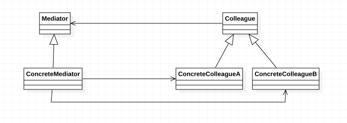

> ***中介者模式（Mediator Pattern）：*** 用一个中介对象（中介者）来封装一系列的对象交互，中介者使各对象不需要显示地相互引用，从而使其耦合松散，而且还可以独立地改变它们之间的交互。中介者模式又称为调停者模式，它是一种对象行为型模式。

在中介者模式中，我们引入了用于协调其他对象/类之间相互调用的中介者类，为了让系统具有更好的灵活性和可扩展性，通常还提供了抽象中介者，其结构图如下图所示：

