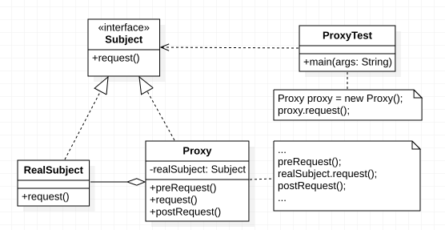

# 代理模式定义

> ***代理模式（Proxy Pattern）：*** 给某一个对象提供一个代理或占位符，并由代理对象来控制对原对象的访问。


 代理模式是一种对象结构型模式。在代理模式中引入了一个新的代理对象，代理对象在客户端对象和目标对象之间起到中介的作用，它去掉客户不能看到的内容和服务或者增添客户需要的额外的新服务。


# 代理模式架构

代理模式的结构如下图所示：




代理模式包含如下三个角色：

***Subject（抽象主题角色）:*** 它声明了真实主题和代理主题的共同接口，这样一来在任何使用真实主题的地方都可以使用代理主题，客户端通常需要针对抽象主题角色进行编程。

***Proxy（代理主题角色）：*** 它包含了对真实主题的引用，从而可以在任何时候操作真实主题对象；在代理主题角色中提供一个与真实主题角色相同的接口，以便在任何时候都可以替代真实主题；代理主题角色还可以控制对真实主题的使用，负责在需要的时候创建和删除真实主题对象，并对真实主题对象的使用加以约束。通常，在代理主题角色中，客户端在调用所引用的真实主题操作之前或之后还需要执行其他操作，而不仅仅是单纯调用真实主题对象中的操作。

***RealSubject（真实主题角色）：*** 它定义了代理角色所代表的真实对象，在真实主题角色中实现了真实的业务操作，客户端可以通过代理主题角色间接调用真实主题角色中定义的操作。


# 代理模式代码实现

典型代理模式代码实现如下所示：

```java
public static void main(String[] args) {
    // 使用代理对象
    Proxy proxy = new Proxy();
    proxy.request();
}

/**
 * 抽象主题
 */
public interface Subject {
    void request();
}

/**
 * 真实主题
 */
public class RealSubject implements Subject {
    @Override
    public void request() {
        System.out.println("访问真实主题方法...");
    }
}

/**
 * 代理
 */
public class Proxy implements Subject {
    // 真实主题
    private RealSubject realSubject;

    @Override
    public void request() {
        if(realSubject == null) {
            realSubject = new RealSubject();
        }
        preRequest();
        // 调用真实主题方法
        realSubject.request();
        postRequest();
    }

    public void preRequest() {
        System.out.println("访问真实主题之前的预处理操作。");
    }

    public void postRequest() {
        System.out.println("访问真实主题之后的后续处理操作。");
    }
}

```


# 代理模式总结

## 代理模式效果与适用场景

代理模式是常用的结构型设计模式之一，它为对象的间接访问提供了一个解决方案，可以对对象的访问进行控制。代理模式类型较多，其中远程代理、虚拟代理、保护代理等在软件开发中应用非常广泛。


## 模式优点

代理模式的共同优点如下：

​    (1) 能够协调调用者和被调用者，在一定程度上降低了系统的耦合度。

​    (2) 客户端可以针对抽象主题角色进行编程，增加和更换代理类无须修改源代码，符合开闭原则，系统具有较好的灵活性和可扩展性。

​    此外，不同类型的代理模式也具有独特的优点，例如：

​    (1) ***远程代理***为位于两个不同地址空间对象的访问提供了一种实现机制，可以将一些消耗资源较多的对象和操作移至性能更好的计算机上，提高系统的整体运行效率。

​    (2) ***虚拟代理***通过一个消耗资源较少的对象来代表一个消耗资源较多的对象，可以在一定程度上节省系统的运行开销。

​    (3) ***缓冲代理***为某一个操作的结果提供临时的缓存存储空间，以便在后续使用中能够共享这些结果，优化系统性能，缩短执行时间。

​    (4) ***保护代理***可以控制对一个对象的访问权限，为不同用户提供不同级别的使用权限。


## 模式缺点

 代理模式的主要缺点如下：

​    (1) 由于在客户端和真实主题之间增加了代理对象，因此有些类型的代理模式可能会造成请求的处理速度变慢，例如保护代理。

​    (2) 实现代理模式需要额外的工作，而且有些代理模式的实现过程较为复杂，例如远程代理。


## 模式适用场景

代理模式的类型较多，不同类型的代理模式有不同的优缺点，它们应用于不同的场合：

1. 当客户端对象需要访问远程主机中的对象时可以使用`远程代理`。
2.  当需要用一个消耗资源较少的对象来代表一个消耗资源较多的对象，从而降低系统开销、缩短运行时间时可以使用`虚拟代理`，例如一个对象需要很长时间才能完成加载时。
3. 当需要为某一个被频繁访问的操作结果提供一个临时存储空间，以供多个客户端共享访问这些结果时可以使用`缓冲代理`。通过使用缓冲代理，系统无须在客户端每一次访问时都重新执行操作，只需直接从临时缓冲区获取操作结果即可。
4. 当需要控制对一个对象的访问，为不同用户提供不同级别的访问权限时可以使用`保护代理`。
5. 当需要为一个对象的访问（引用）提供一些额外的操作时可以使用`智能引用代理`。

# 扩展-Java 动态代理

根据代理的创建时期，代理模式分为静态代理和动态代理。

- 静态：由程序员创建代理类或特定工具自动生成源代码再对其编译，在程序运行前代理类的 .class 文件就已经存在了。
- 动态：在程序运行时，运用反射机制动态创建而成。在 Java 中提供了动态代理技术。


在上面的代码中，我们创建代理类`Proxy`并实现了`Subject`接口。这种方式称之为静态代理，因为在承运运行之前代理类`Proxy`已经存在了。`JDK`中提供了一种动态创建接口对象的方式，称之为动态代理。


```java
import java.lang.reflect.InvocationHandler;
import java.lang.reflect.Method;
import java.lang.reflect.Proxy;

public static void main(String[] args) {
    // 用于实现接口中的方法逻辑。
    InvocationHandler handler = new InvocationHandler() {
        @Override
        public Object invoke(Object proxy, Method method, Object[] args) throws Throwable {
            System.out.println(method);
            if(method.getName().equals("request")) {
                System.out.println("调用了request()方法。");
            }
            return null;
        }
    };
    Subject subject = (Subject) Proxy.newProxyInstance(
        Subject.class.getClassLoader(), // Subject 的类加载器
        new Class[]{Subject.class}, // 传入要实现的接口类
        handler // 处理接口方法的处理器
    );

    // 调用接口方法
    subject.request();
}
```


1. 首先定义一个`InvocationHandler`实例，它负责实现接口中方法的真实逻辑。其`invoke`方法参数含义如下：
    - `proxy:` 代理对象。
    - `method:` 调用方法的信息。
    - `args:` 调用方法的参数信息。
2. 通过`Proxy.newProxyInstance()`创建`Subject`接口实例，并需要传入三个参数：
    - 接口类的类加载器。
    - 需要实现的接口数组，至少需要传入一个接口。
    - 用来处理接口中方法逻辑的`InvocationHandler`实例。
3. 将返回的`Object`对象强转成接口类型。
4. 使用接口实例调用方法。


这种没有实现类但是在运行期动态创建了一个接口对象的方式，我们称为动态代码。`JDK`提供的动态创建接口对象的方式，就叫`动态代理`。

