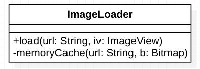
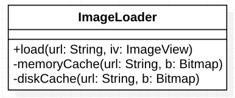
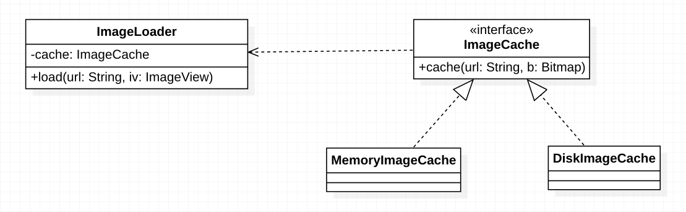

***单一职责原则（Single Responsibility Principle,SRP)：*** 又称`单一功能原则`，这里的职责可以指模块、类或者方法登录变化的原因，单一职责原则规定一个模块、类或者方法应该有且仅有一个引起变化的原因，否则应该被拆分。

单一职责原则告诉我们：一个类不能管的事情太多，在软件系统中，一个类（大到模块，小到方法）承担的职责越多，它被复用的可能性就越小。如果过一个类承担的职责过多，就相当于这些职责耦合在一起，当其中一个职责变化时，可能会影响其他职责的运作，因此要将这写职责进行分离，将不同的职责封装在不同的类中，即将不同的变化原因封装在不同的类中。

单一职责原则是实现`高内聚、低耦合`的知道方针，它是最简单但又是最难用的原则。

下面通过一个简单的案例来说明如何实现单一职责原则。

`洞洞幺`在开发APP时需要实现一个加载图片的功能，于是做出了如下设计（简化版本，为了说明单一职责原则）。

`洞洞幺`在`ImageLoader`中封装了图片加载功能和内存缓存图片的功能，然后顺利上线。后来需求有变，为了提升用户体验，节省流量需要增加本地磁盘缓存，于是`洞洞幺`给出了如下设计。

可以看到`ImageLoader`中增加了本地磁盘缓存的方法，这明显违背了`开闭原则`，通过分析`ImageLoader`违背了`单一职责原则`，它即负责加载图片，又负责缓存图片。于是`洞洞幺`继续重构，最终给出了如下设计。

首先将缓存功能抽象成`ImageCache`并分别实现`MemoryImageCache`内存缓存和`DiskImageCache`本地磁盘缓存功能。然后`ImageLoader`只需要依赖`ImageCache`编程即可完成图片的缓存功能，这样当缓存需求发生变化时就不会影响`ImageLoader`的功能了。拆分后的`ImageLoader`和`ImageCache`都符合了`单一职责原则`，也符合了`开闭原则`。

