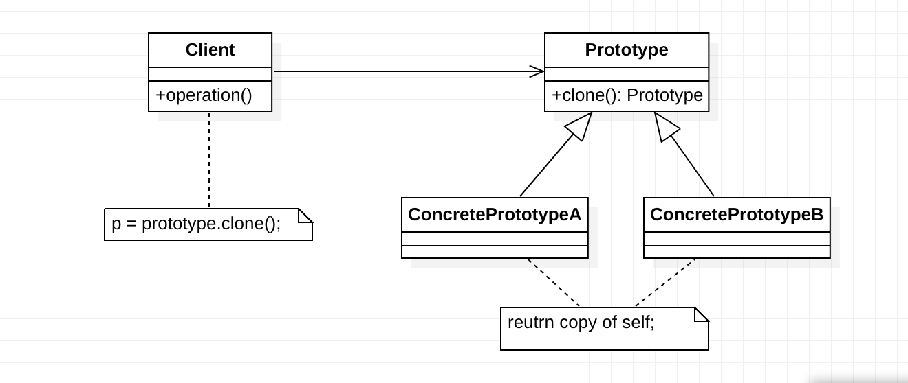

> ***原型模式（Prototype Pattern）：*** 使用原型实例指定创建对象的种类，并且通过拷贝这些原型创建新的对象。原型模式是一种对象创建型模式。


# 原型模式结构图

原型模式结构图如下所示：



在原型模式结构图中包含如下几个角色：

- ***Prototype（抽象原型类）*** ：它是声明克隆方法的接口，是所有具体原型类的公共父类，可以是抽象类也可以是接口，甚至还可以是具体实现类。
- ***ConcretePrototype（具体原型类）*** ：它实现在抽象原型类中声明的克隆方法，在克隆方法中返回自己的一个克隆对象。
- ***Client（客户类）***：让一个原型对象克隆自身从而创建一个新的对象，在客户类中只需要直接实例化或通过工厂方法等方式创建一个原型对象，再通过调用该对象的克隆方法即可得到多个相同的对象。由于客户类针对抽象原型类Prototype编程，因此用户可以根据需要选择具体原型类，系统具有较好的可扩展性，增加或更换具体原型类都很方便。

  

# 原型模式代码实现

 原型模式的核心在于如何实现克隆方法，下面将介绍两种在Java语言中常用的克隆实现方法：


## 通用实现方法

通用的克隆实现方法是在具体原型类的克隆方法中实例化一个与自身类型相同的对象并将其返回，并将相关的参数传入新创建的对象中，保证它们的成员属性相同。示意代码如下所示：

```java
/**
 * 原型接口
 */
public interface Prototype {
    public Prototype clone();
}

/**
 * 具体原型
 */
public class ConcretePrototype implements Prototype {

    private String attr; // 属性

    public String getAttr() {
        return attr;
    }

    public void setAttr(String attr) {
        this.attr = attr;
    }

    @Override
    public Prototype clone() {
        // 创建新对象
        ConcretePrototype prototype = new ConcretePrototype();
        prototype.setAttr(this.attr);
        return prototype;
    }
}

```


这种方法可作为原型模式的通用实现，它与编程语言特性无关，任何面向对象语言都可以使用这种形式来实现对原型的克隆。


## Java语言提供的 clone()方法

学过Java语言的人都知道，所有的`Java`类都继承自`java.lang.Object`。事实上，`Object`类提供一个`clone()`方法，可以将一个`Java`对象复制一份。因此在`Java`中可以直接使用`Object`提供的`clone()`方法来实现对象的克隆，`Java`语言中的原型模式实现很简单。

需要注意的是能够实现克隆的`Java`类必须实现一个标识接口`Cloneable`，表示这个`Java`类支持被复制。如果一个类没有实现这个接口但是调用了`clone()`方法，`Java`编译器将抛出一个`CloneNotSupportedException`异常。如下代码所示：

```java
public class ConcretePrototypeA implements Cloneable {

    @Override
    public Prototype clone() {
        Object object = null;
        try {
            object = super.clone();
        } catch (CloneNotSupportedException exception) {
            System.err.println("Not support cloneable");
        }
        return (Prototype) object;
    }

}

```


一般而言，`Java`语言中的`clone()`方法满足：

1. 对任何对象`x`，都有`x.clone() != x`，即克隆对象与原型对象不是同一个对象；

2. 对任何对象`x`，都有`x.clone().getClass() == x.getClass()`，即克隆对象与原型对象的类型一样；

3. 如果对象`x`的`equals()`方法定义恰当，那么`x.clone().equals(x)`应该成立。

   

为了获取对象的一份拷贝，我们可以直接利用`Object`类的`clone()`方法，具体步骤如下：

1. 在派生类中覆盖基类的`clone()`方法，并声明为`public`；

2. 在派生类的`clone()`方法中，调用`super.clone()`；

3. 派生类需实现`Cloneable`接口。


此时，`Object`类相当于抽象原型类，所有实现了`Cloneable`接口的类相当于具体原型类。


# 浅克隆模式与深克隆模式

1. 浅克隆模式

    在浅克隆中，如果原型对象的成员变量是值类型，将复制一份给克隆对象；如果原型对象的成员变量是引用类型，则将引用对象的地址复制一份给克隆对象，也就是说原型对象和克隆对象的成员变量指向相同的内存地址。简单来说，在浅克隆中，当对象被复制时只复制它本身和其中包含的值类型的成员变量，而引用类型的成员对象并没有复制。

    在Java语言中，通过覆盖Object类的clone()方法可以实现浅克隆。

2. 深克隆模式

    在深克隆中，无论原型对象的成员变量是值类型还是引用类型，都将复制一份给克隆对象，深克隆将原型对象的所有引用对象也复制一份给克隆对象。简单来说，在深克隆中，除了对象本身被复制外，对象所包含的所有成员变量也将复制。

    在Java语言中，如果需要实现深克隆，可以通过序列化(Serialization)等方式来实现。序列化就是将对象写到流的过程，写到流中的对象是原有对象的一个拷贝，而原对象仍然存在于内存中。通过序列化实现的拷贝不仅可以复制对象本身，而且可以复制其引用的成员对象，因此通过序列化将对象写到一个流中，再从流里将其读出来，可以实现深克隆。需要注意的是能够实现序列化的对象其类必须实现Serializable接口，否则无法实现序列化操作。


# 原型管理器的引入和实现

原型管理器(Prototype Manager)是将多个原型对象存储在一个集合中供客户端使用，它是一个专门负责克隆对象的工厂，其中定义了一个集合用于存储原型对象，如果需要某个原型对象的一个克隆，可以通过复制集合中对应的原型对象来获得。在原型管理器中针对抽象原型类进行编程，以便扩展。


# 原型模式总结

原型模式作为一种快速创建大量相同或相似对象的方式，在软件开发中应用较为广泛，很多软件提供的复制(Ctrl + C)和粘贴(Ctrl + V)操作就是原型模式的典型应用，下面对该模式的使用效果和适用情况进行简单的总结。

## 主要优点

原型模式的主要优点如下：

1. 当创建新的对象实例较为复杂时，使用原型模式可以简化对象的创建过程，通过复制一个已有实例可以提高新实例的创建效率。

2. 扩展性较好，由于在原型模式中提供了抽象原型类，在客户端可以针对抽象原型类进行编程，而将具体原型类写在配置文件中，增加或减少产品类对原有系统都没有任何影响。

3. 原型模式提供了简化的创建结构，工厂方法模式常常需要有一个与产品类等级结构相同的工厂等级结构，而原型模式就不需要这样，原型模式中产品的复制是通过封装在原型类中的克隆方法实现的，无须专门的工厂类来创建产品。

4. 可以使用深克隆的方式保存对象的状态，使用原型模式将对象复制一份并将其状态保存起来，以便在需要的时候使用（如恢复到某一历史状态），可辅助实现撤销操作。


## 主要缺点

原型模式的主要缺点如下：

1. 需要为每一个类配备一个克隆方法，而且该克隆方法位于一个类的内部，当对已有的类进行改造时，需要修改源代码，违背了“开闭原则”。

2. 在实现深克隆时需要编写较为复杂的代码，而且当对象之间存在多重的嵌套引用时，为了实现深克隆，每一层对象对应的类都必须支持深克隆，实现起来可能会比较麻烦。

## 适用场景

在以下情况下可以考虑使用原型模式：

1. 创建新对象成本较大（如初始化需要占用较长的时间，占用太多的CPU资源或网络资源），新的对象可以通过原型模式对已有对象进行复制来获得，如果是相似对象，则可以对其成员变量稍作修改。

2. 如果系统要保存对象的状态，而对象的状态变化很小，或者对象本身占用内存较少时，可以使用原型模式配合备忘录模式来实现。

3. 需要避免使用分层次的工厂类来创建分层次的对象，并且类的实例对象只有一个或很少的几个组合状态，通过复制原型对象得到新实例可能比使用构造函数创建一个新实例更加方便。

