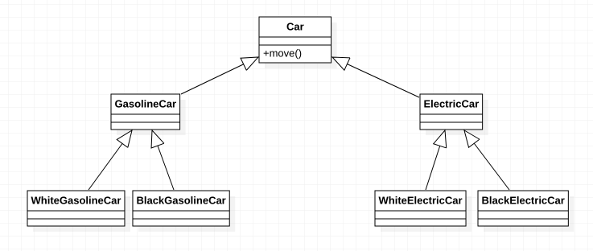
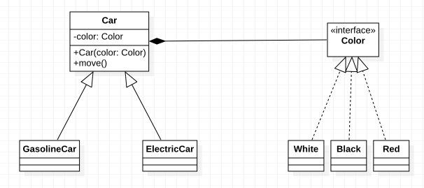

***合成复用原则（Composite Reuse Principle，CRP）：*** 尽量使用对象组合，而不是使用继承达到复用的目的。

即在设计软件复用时，优先使用组合或者聚合等关联关系来实现，其次才考虑使用继承关系来实现。

通常类的复用分为`继承复用`和`合成复用`两种，虽然继承复用简单、容易实现，但是也存在以下缺点：

- 继承复用破坏了类的封装性，因为继承会将父类的实现细节暴露给子类，父类对子类是透明的，所以这种复用又称为“白箱”复用。
- 子类与父类的耦合度高。父类实现有任何的变化都有可能导致子类发生变化，这不利于类的扩展和维护。
- 他限制了复用的灵活性。从父类继承而来的实现时静态的，在编译时已经确定，所以在运行时不可能发生变化。

而采用合成复用时，可以将已有对象纳入新对象中，使之成为新对象的一部分，新对象可以调用已有对象的功能，合成复用相比继承复用有以下优点：

- 他维持了类的封装性。因为被复用对象的内部实现细节是合成对象不可见的。所以这种复用又称为“黑箱”复用。
- 新就类之间的耦合度低。合成复用相比继承复用所需的依赖较少，因为合成对象只能通过被复用对象暴露的接口进行复用。
- 复用的灵活性高。合成复用可以利用多态的特性在运行时动态进行，使其程序更容易扩展。

例如：汽车按照“动力来源”划分可以分为汽油汽车、电动汽车等，并且每类汽车都可以有多种颜色。如果使用继承复用会有类似如下设计：

从上面的设计可以看出，增加新的“动力源”或者增加新的颜色都需要修改源码，并且会导致产生很多子类，显然这种设计存在很大的问题，如果使用合成复用会怎样呢？

如上图所示，使用组合复用的方式明显的减少了子类的数量，并且新增“动力源”或者颜色都很方便。

