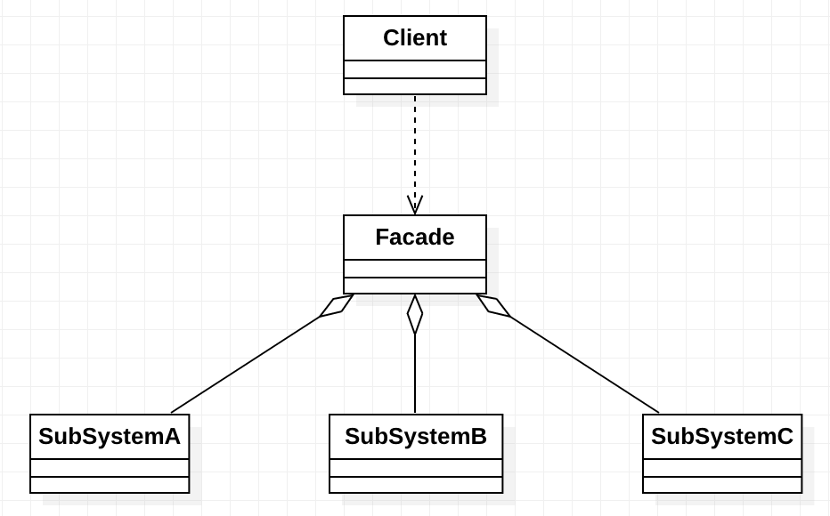
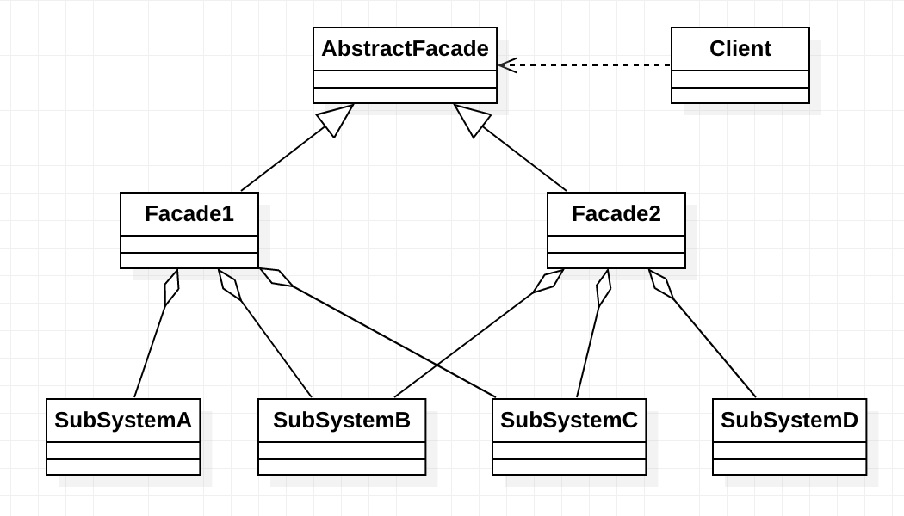

# 外观模式简介


在日常编码工作中，我们都在有意无意的大量使用外观模式。只要高层模块需要调度多个子系统（2 个以上的类对象），我们都会自觉地创建一个新的类封装这些子系统，提供精简的接口，让高层模块可以更加容易地间接调用这些子系统的功能。尤其是现阶段各种第三方 SDK、开源类库，很大概率都会使用外观模式。


***外观模式（Facede Pattern）：*** 为子系统中的一组接口提供一个统一的入口。外观模式定义了一个高层接口，这个接口使得这一子系统更加容易使用。


`外观模式`又称作`门面模式`，它是一种对象`结构型模式`。外观模式是`迪米特法则（最少知道原则）`的一种具体实现，通过引入一个新的外观模式可以降低原有系统的复杂度，同时降低客户类与子系统的耦合度。


在外观模式中，一个子系统的外部与其内部的通信通过一个统一的外观类进行，外观类将客户类与子系统的内部复杂性分隔开，使得客户类只需要与外观角色打交道，而不需要与子系统内部的很多对象打交道。


# 外观模式的结构与实现

外观模式的结构比较简单，主要定义了一个高层接口。它包含了对各个子系统的引用，客户端可以通过它访问各个子系统的功能。现在来分析其基本结构和实现方法。


## 模式的结构

外观模式包含以下主要角色。

1. 外观（Facade）角色：为多个子系统对外提供一个共同的接口。
2. 子系统（Sub System）角色：实现系统的部分功能，客户可以通过外观角色访问它。
3. 客户（Client）角色：通过一个外观角色访问各个子系统的功能。


其结构图如下图所示：




## 模式的实现

外观模式的实现代码如下：

```java
public static void main(String[] args) {
    // 客户端
    Facade facade = new Facade();
    facade.method();
}


/**
 * 外观角色
 */
public class Facade {
    
    private SubSystemA systemA = new SubSystemA();
    private SubSystemB systemB = new SubSystemB();
    private SubSystemC systemC = new SubSystemC();

    public void method() {
        systemA.methodA();
        systemB.methodB();
        systemC.methodC();
    }
}

/**
 * 子系统角色 A
 */
public class SubSystemA {

    public void methodA() {
        System.out.println("子系统 A 的 methodA()被调用。");
    }
}

/**
 * 子系统角色 B
 */
public class SubSystemB {

    public void methodB() {
        System.out.println("子系统 B 的 methodB()被调用。");
    }
}

/**
 * 子系统角色 C
 */
public class SubSystemC {

    public void methodC() {
        System.out.println("子系统 C 的 methodC()被调用。");
    }
}
```


# 抽象外观类

在外观模式中，当增加或移除子系统时需要修改外观类，这违背了“开闭原则”。如果引入抽象外观类，则在一定程度上解决了该问题，其结构图如下图所示。




如上图所示，在引入抽象外观类之后，客户端直接依赖抽象外观类进行编码，如果子系统有修改直接增加一个新的具体外观类即可。


# 总结

***外观模式的主要优点如下：***

1. 它对客户端屏蔽了子系统组件，减少了客户端所需处理的对象数目，并使得子系统使用起来更加容易。通过引入外观模式，客户端代码将变得简单，与之关联的对象也很少。
2. 它实现了子系统与客户端之间的松耦合关系，这使得子系统的变化不会影响到调用它的客户端，只需要调整外观类即可。
3. 一个子系统的修改对其子系统没有任何影响，而且子系统内部变化也不会影响到外观对象。


***外观模式的主要缺点如下：***

1. 不能很好地限制客户端直接使用子系统，如果对客户端子系统类做太多的限制则减少了可变性和灵活性。
2. 如果设计不当，增加新的子系统可能需要修改外观类的源代码，违背了开闭原则。


***外观模式适用的场景：***

在以下情况可以考虑使用外观模式：

1. 当要为访问一系列复杂的子系统提供一个简单入口时可以使用外观模式。
2. 客户端程序与多个子系统之间存在很大的依赖性。引入外观类可以将子系统与客户端解耦，从而提高子系统的独立性和可移植性。
3. 在层次化结构总，可以使用外观模式定义系统中每一层的入口，层与层之间不直接产生联系，而通过外观类建立联系，降低层之间的耦合度。