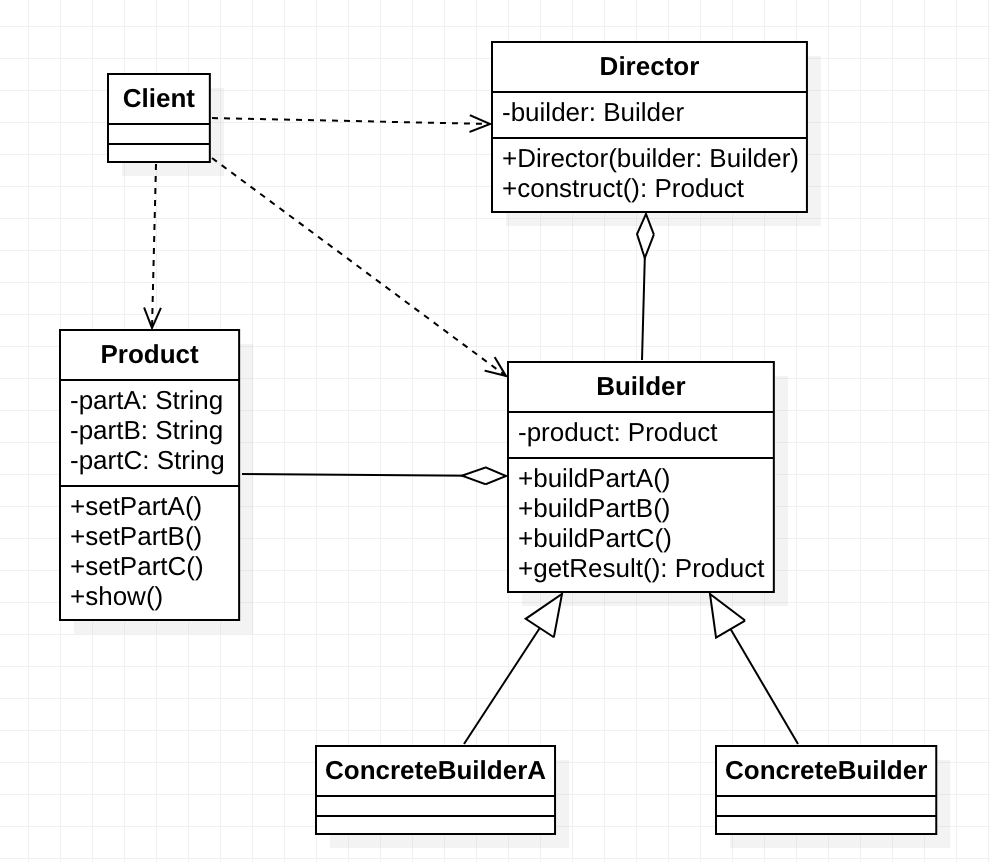

***建造者（Builder）模式：*** 指将一个复杂的构造与它的表示分离，使得同样的构建过程可以创建不同的表示，这样的设计模式被称为建造者模式。它是将一个复杂的对象分解为多个简单的对象，然后一步一步构建而成。它将变与不变相分离，即产品的组成部分是不变的。但每一部分是可以灵活选择的。它是创建型模式。


在建造者模式结构图中包含如下几个角色：

- ***Builder（抽象建造者）：*** 它为创建一个产品 `Product `对象的各个部件指定抽象接口，在该接口中一般声明两类方法，一类方法是 `buildPartX()`，它们用于创建复杂对象的各个部件；另一类方法是`getResult()`,它们用于返回复杂对象。`Builder`即可以是抽象类，也可以是接口。
- ***ConcreteBuilder（具体建造者）：*** 它实现了 Builder 接口，实现各个部件具体构造和装配方法，定义并明确它所创建的复杂对象。也可以提供一个方法返回创建好的复杂产品对对象。
- ***Product（产品角色）：*** 它是被构建的复杂对象，包含多个组成部件，具体建造者创建该产品的内部表示并定义它的装配过程。
- ***Director（指挥者）：*** 指挥者又称为导演类，它负责安排复杂对象的建造次序，指挥者与抽象建造者之间存在关联关系。可以在其`construct()`建造方法中调用建造者对象的部件构造与装配方法。完成复杂对象的建造。客户端一般只需要与指挥者进行交互，在客户端确定具体建造者的类型，并实例化具体建造者对象，然后通过指挥者类的构造函数或者`Setter`方法将该对象传入指挥者类中。


典型的建造者模式如下图所示：





其代码实现方式如下：

```java

/**
 * 产品类
 */
public class Product {
    // 产品属性
    private String partA;
    private String partB;
    private String partC;

    public String getPartA() {
        return partA;
    }

    public void setPartA(String partA) {
        this.partA = partA;
    }

    public String getPartB() {
        return partB;
    }

    public void setPartB(String partB) {
        this.partB = partB;
    }

    public String getPartC() {
        return partC;
    }

    public void setPartC(String partC) {
        this.partC = partC;
    }

    public void show() {
        // 展示产品
        System.out.println(toString());
    }

    @Override
    public String toString() {
        return "Product{" +
                "partA='" + partA + '\'' +
                ", partB='" + partB + '\'' +
                ", partC='" + partC + '\'' +
                '}';
    }
}

/**
 * 抽象建造者
 */
public abstract class Builder {
    protected Product product = new Product();
    // 建造方法
    public abstract void buildPartA();
    public abstract void buildPartB();
    public abstract void buildPartC();

    // 获取产品实例
    public Product getResult() {
        return product;
    }
}


/**
 * 具体建造者
 */
public class ConcreteBuilderA extends Builder {

    @Override
    public void buildPartA() {
        product.setPartA("建造者A PartA");
    }

    @Override
    public void buildPartB() {
        product.setPartB("建造者A PartB");
    }

    @Override
    public void buildPartC() {
        product.setPartC("建造者A PartC");
    }

    @Override
    public Product getResult() {
        return product;
    }
}


/**
 * 具体建造者
 */
public class ConcreteBuilderB extends Builder {

    @Override
    public void buildPartA() {
        product.setPartA("建造者B PartA");
    }

    @Override
    public void buildPartB() {
        product.setPartB("建造者B PartB");
    }

    @Override
    public void buildPartC() {
        product.setPartC("建造者B PartC");
    }

    @Override
    public Product getResult() {
        return product;
    }
}

/**
 * 指挥者
 */
public class Director {
    private Builder builder;

    public Director(Builder builder) {
        this.builder = builder;
    }

    // 建造产品
    public Product construct() {
        builder.buildPartA();
        builder.buildPartB();
        builder.buildPartC();
        return builder.getResult();
    }
}

public static void main(String[] args) {
    // 客户端代码
    Builder builder = new ConcreteBuilderA();
    Director director = new Director(builder);
    Product product = director.construct();
    product.show();
}

```


上面就是建造者模式的典型实现方式，有些情况为了简化系统结构可以将`Director`和抽象的建造者`Builder`进行合并，在`Builder`中提供逐步构建复杂产品对象的 `construct()`方法。由于`Builder`类通常为抽象类，因此可以将`construct()`方法定义为静态`(static)`方法。


改造后的代码如下：

```java
/**
 * 抽象建造者
 */
public abstract class Builder {
    protected Product product = new Product();
    // 建造方法
    public abstract void buildPartA();
    public abstract void buildPartB();
    public abstract void buildPartC();

    // 获取产品实例
    public Product getResult() {
        return product;
    }

    /**
     * 代替 Director.construct()方法建造产品
     */
    public static Product construct(Builder builder) {
        builder.buildPartA();
        builder.buildPartB();
        builder.buildPartC();
        return builder.getResult();
    }
}

public static void main(String[] args) {
    // 客户端代码
    Builder builder = new ConcreteBuilderA();
    Product product = Builder.construct(builder);
    product.show();
}
```


改造后的 `Builder`增加了建造产品的`construct(Builder builder)`方法，这样客户端在使用的时候就不需要`Director`类了。简化了系统的复杂度。


对于上面的改造我们还可以继续优化，将`construct()`方法的参数去掉，直接在`construct()`方法中调用`buildPartX()`方法，代码如下所示：


```java
/**
 * 抽象建造者
 */
public abstract class Builder {
    protected Product product = new Product();
    // 建造方法
    public abstract void buildPartA();
    public abstract void buildPartB();
    public abstract void buildPartC();

    /**
     * 代替 Director.construct()方法建造产品
     */
    public Product construct() {
        buildPartA();
        buildPartB();
        buildPartC();
        return getResult();
    }
}

public static void main(String[] args) {
    // 客户端代码
    Builder builder = new ConcreteBuilderA();
    Product product = builder.construct();
    product.show();
}
```


以上两种对`Director`类的省略方式都不影响系统的灵活性和可扩展性，同时还简化了系统结构，但加重了抽象建造者类的职责，如果`construct()`方法较为复杂，待构建产品的组成部分较多，建议还是将`construct()`方法单独封装在`Director`中，这样做更符合“单一职责原则”。


# 建造者模式总结

1. 该模式的主要优点如下：
    1. 封装性好，构建和表示分离。
    2. 扩展性好，各个具体的建造者相互独立，有利于系统的解耦。
    3. 客户端不必知道产品内部组成的细节，建造者可以对创建过程逐步细化，而不对其它模块产生任何影响，便于控制细节风险。


2. 其缺点如下：

    1. 产品的组成部分必须相同，这限制了其使用范围。
    2. 如果产品的内部变化复杂，如果产品内部发生变化，则建造者也要同步修改，后期维护成本较大。


建造者（Builder）模式和工厂模式的关注点不同：建造者模式注重零部件的组装过程，而工厂方法模式更注重零部件的创建过程，但两者可以结合使用。


3. 在以下情况下可以考虑使用建造者模式：
    1. 需要生成的产品对象有复杂的内部结构，这些产品对象通常包含多个成员属性。
    2. 需要生成的产品对象的属性相互依赖，需要指定其生成顺序。
    3. 对象的创建过程独立于创建该对象的类。在建造者模式中通过引入了指挥者类，将创建过程封装在指挥者类中，而不在建造者类和客户类中。
    4. 隔离复杂对象的创建和使用，并使得相同的创建过程可以创建不同的产品。


