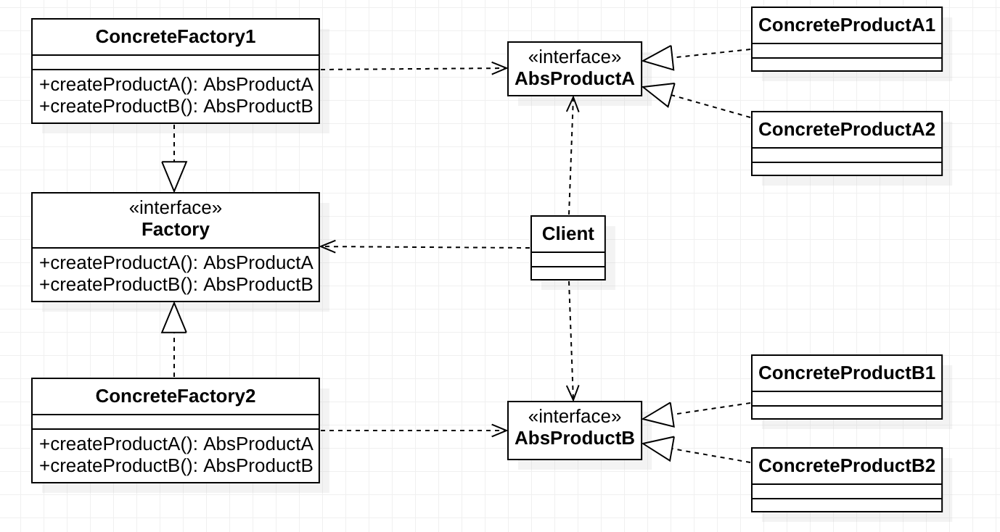

# 抽象工厂模式定义

> ***抽象工厂模式（Abstract Factory Pattern）：*** 提供一个创建一系列相关或相互依赖对象的接口，而无须指定它们具体的类。抽象工厂模式又称为 Kit 模式，它是一种对象创建型模式。


工厂方法模式通过引入工厂等级结构，解决了简单工厂模式中工厂类职责太重的问题，但由于工厂方法模式中的每个工厂只生产一类产品，可能会导致系统中存在大量的工厂类，势必会增加系统的开销。此时，我们可以考虑***将一些相关的产品组成一个“产品族”，由同一个工厂来统一生产***，这就是我们本文将要学习的抽象工厂模式的基本思想。

在工厂方法模式中具体工厂负责生产具体的产品，每一个具体工厂对应一种具体产品，工厂方法具有唯一性，一般情况下，一个具体工厂中只有一个或者一组重载的工厂方法。但是有时候我们希望一个工厂可以提供多个产品对象，而不是单一的产品对象，如一个电器工厂，它可以生产电视机、电冰箱、空调等多种电器，而不是只生产某一种电器。为了更好地理解抽象工厂模式，我们先引入两个概念：

1. **产品等级结构**：***产品等级结构即产品的继承结构***，如一个抽象类是电视机，其子类有海尔电视机、海信电视机、TCL电视机，则抽象电视机与具体品牌的电视机之间构成了一个产品等级结构，抽象电视机是父类，而具体品牌的电视机是其子类。
2. **产品族**：在抽象工厂模式中，***产品族是指由同一个工厂生产的，位于不同产品等级结构中的一组产品***，如海尔电器工厂生产的海尔电视机、海尔电冰箱，海尔电视机位于电视机产品等级结构中，海尔电冰箱位于电冰箱产品等级结构中，海尔电视机、海尔电冰箱构成了一个产品族。


在抽象工厂模式中，每一个具体工厂都提供了多个工厂方法用于产生多种不同类型的产品，这些产品构成了一个产品族，抽象工厂模式结构如下图所示：




 在抽象工厂模式结构图中包含如下几个角色：

- ***AbstractFactory（抽象工厂）：*** 它声明了一组用于创建一族产品的方法，每一个方法对应一种产品。
- ***ConcreteFactory（具体工厂）：*** 它实现了在抽象工厂中声明的创建产品的方法，生成一组具体产品，这些产品构成了一个产品族，每一个产品都位于某个产品等级结构中。

- ***AbstractProduct（抽象产品）：*** 它为每种产品声明接口，在抽象产品中声明了产品所具有的业务方法。
- ***ConcreteProduct（具体产品）：*** 它定义具体工厂生产的具体产品对象，实现抽象产品接口中声明的业务方法。

​    

在抽象工厂中声明了多个工厂方法，用于创建不同类型的产品，抽象工厂可以是接口，也可以是抽象类或者具体类，其典型代码如下所示：


# 抽象工厂代码实现

```java
/**
 * 抽象产品A
 */
public abstract class AbstractProductA { }

/**
 * 具体产品 A1
 */
public class ConcreteProductA1 extends AbstractProductA { }

/**
 * 具体产品 A2
 */
public class ConcreteProductA2 extends AbstractProductA { }

/**
 * 抽象产品 B
 */
public abstract class AbstractProductB { }

/**
 * 具体产品 B1
 */
public class ConcreteProductB1 extends AbstractProductB { }

/**
 * 具体产品 B2
 */
public class ConcreteProductB2 extends AbstractProductB { }

/**
 * 抽象工厂
 */
public abstract class AbstractFactory {
    public abstract AbstractProductA createProductA(); //工厂方法一
    public abstract AbstractProductB createProductB(); //工厂方法二
    //……
}

/**
 * 具体工厂 1
 */
public class ConcreteFactory1 extends AbstractFactory {
    @Override
    public AbstractProductA createProductA() {
        return new ConcreteProductA1();
    }

    @Override
    public AbstractProductB createProductB() {
        return new ConcreteProductB1();
    }
}

/**
 * 具体工厂 2
 */
public class ConcreteFactory2 extends AbstractFactory {
    @Override
    public AbstractProductA createProductA() {
        return new ConcreteProductA2();
    }

    @Override
    public AbstractProductB createProductB() {
        return new ConcreteProductB2();
    }
}
```


# 抽象工厂模式总结

​    抽象工厂模式是工厂方法模式的进一步延伸，由于它提供了功能更为强大的工厂类并且具备较好的可扩展性，在软件开发中得以广泛应用，尤其是在一些框架和API类库的设计中，例如在Java语言的AWT（抽象窗口工具包）中就使用了抽象工厂模式，它使用抽象工厂模式来实现在不同的操作系统中应用程序呈现与所在操作系统一致的外观界面。抽象工厂模式也是在软件开发中最常用的设计模式之一。

 

## 主要优点

抽象工厂模式的主要优点如下：

1. 抽象工厂模式隔离了具体类的生成，使得客户并不需要知道什么被创建。由于这种隔离，更换一个具体工厂就变得相对容易，所有的具体工厂都实现了抽象工厂中定义的那些公共接口，因此只需改变具体工厂的实例，就可以在某种程度上改变整个软件系统的行为。
2. 当一个产品族中的多个对象被设计成一起工作时，它能够保证客户端始终只使用同一个产品族中的对象。
3. 增加新的产品族很方便，无须修改已有系统，符合“开闭原则”。

 

## 主要缺点

抽象工厂模式的主要缺点如下：

增加新的产品等级结构麻烦，需要对原有系统进行较大的修改，甚至需要修改抽象层代码，这显然会带来较大的不便，违背了“开闭原则”。

 

## 适用场景

在以下情况下可以考虑使用抽象工厂模式：

1. 一个系统不应当依赖于产品类实例如何被创建、组合和表达的细节，这对于所有类型的工厂模式都是很重要的，用户无须关心对象的创建过程，将对象的创建和使用解耦。

2. 系统中有多于一个的产品族，而每次只使用其中某一产品族。可以通过配置文件等方式来使得用户可以动态改变产品族，也可以很方便地增加新的产品族。

3. 属于同一个产品族的产品将在一起使用，这一约束必须在系统的设计中体现出来。同一个产品族中的产品可以是没有任何关系的对象，但是它们都具有一些共同的约束，如同一操作系统下的按钮和文本框，按钮与文本框之间没有直接关系，但它们都是属于某一操作系统的，此时具有一个共同的约束条件：操作系统的类型。

4. 产品等级结构稳定，设计完成之后，不会向系统中增加新的产品等级结构或者删除已有的产品等级结构。