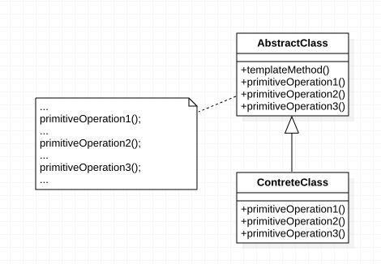

> ***模板方法模式（Template Mthod Pattern）：*** 定义一个操作中算法的框架，而将一些步骤延迟到子类中。模板方法模式使得子类可以不改变一个算法的结构即可重定义该算法的某些特定步骤。


模板方法模式是一种基于继承的代码复用技术，它是一种类行为型模式。


模板方法模式是结构最简单的行为型设计模式，在其结构中只存在父类与子类之间的继承关系。通过使用模板方法模式，可以将一些复杂流程的实现步骤封装在一系列基本方法中，在抽象父类中提供一个称之为模板方法的方法来定义这些基本方法的执行次序，而通过其子类来覆盖某些步骤，从而使得相同的算法框架可以有不同的执行结果。模板方法模式提供了一个模板方法来定义算法框架，而某些具体步骤的实现可以在其子类中完成。





模板方法模式包含如下两个角色：

-  ***AbstractClass（抽象类）：*** 在抽象类中定义了一系列基本操作(PrimitiveOperations)，这些基本操作可以是具体的，也可以是抽象的，每一个基本操作对应算法的一个步骤，在其子类中可以重定义或实现这些步骤。同时，在抽象类中实现了一个模板方法(Template Method)，用于定义一个算法的框架，模板方法不仅可以调用在抽象类中实现的基本方法，也可以调用在抽象类的子类中实现的基本方法，还可以调用其他对象中的方法。
- ***ConcreteClass（具体子类）：*** 它是抽象类的子类，用于实现在父类中声明的抽象基本操作以完成子类特定算法的步骤，也可以覆盖在父类中已经实现的具体基本操作。


在模板方法模式中，抽象类的典型代码如下：

```java
abstract class AbstractClass {
	//模板方法
	public void TemplateMethod() {
        PrimitiveOperation1();
        PrimitiveOperation2();
        PrimitiveOperation3();
	}
 
	//基本方法—具体方法
	public void PrimitiveOperation1() {
    	//实现代码
	}
 
	//基本方法—抽象方法
    public abstract void PrimitiveOperation2();    
 
    //基本方法—钩子方法
    public virtual void PrimitiveOperation3() { 
    }
}

class ConcreteClass : AbstractClass {
    public override void PrimitiveOperation2() {
        //实现代码
    }
 
    public override void PrimitiveOperation3() {
        //实现代码
    }
}
```


 **模板方法模式是基于继承的代码复用技术**，它体现了面向对象的诸多重要思想，是一种使用较为频繁的模式。模板方法模式广泛应用于框架设计中，以确保通过父类来控制处理流程的逻辑顺序（如框架的初始化，测试流程的设置等）。

 

## 模式优点

模板方法模式的主要优点如下：

1. 在父类中形式化地定义一个算法，而由它的子类来实现细节的处理，在子类实现详细的处理算法时并不会改变算法中步骤的执行次序。

2. 模板方法模式是一种代码复用技术，它在类库设计中尤为重要，它提取了类库中的公共行为，将公共行为放在父类中，而通过其子类来实现不同的行为，它鼓励我们恰当使用继承来实现代码复用。

3. 可实现一种反向控制结构，通过子类覆盖父类的钩子方法来决定某一特定步骤是否需要执行。

4. 在模板方法模式中可以通过子类来覆盖父类的基本方法，不同的子类可以提供基本方法的不同实现，更换和增加新的子类很方便，符合单一职责原则和开闭原则。

 

## 模式缺点

模板方法模式的主要缺点如下：

需要为每一个基本方法的不同实现提供一个子类，如果父类中可变的基本方法太多，将会导致类的个数增加，系统更加庞大，设计也更加抽象，此时，可结合**桥接模式**来进行设计。

 

## 模式适用场景

​    在以下情况下可以考虑使用模板方法模式：

1. 对一些复杂的算法进行分割，将其算法中固定不变的部分设计为模板方法和父类具体方法，而一些可以改变的细节由其子类来实现。即：一次性实现一个算法的不变部分，并将可变的行为留给子类来实现。

2. 各子类中公共的行为应被提取出来并集中到一个公共父类中以避免代码重复。

3. 需要通过子类来决定父类算法中某个步骤是否执行，实现子类对父类的反向控制。