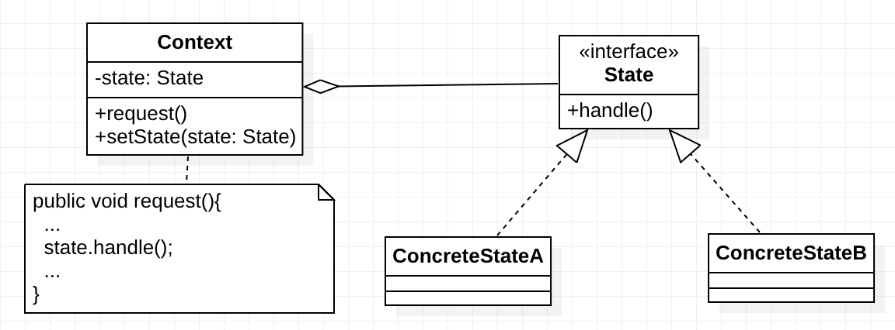

# 状态模式简介


在软件开发过程中，应用程序中的部分对象可能会根据不同的情况做出不同的行为，我们把这种对象称为`有状态的对象`，而把影响对象行为的一个或多个动态变化的属性称为`状态`。当有状态的对象与外部事件产生互动时，其内部状态就会发生改变，从而使其行为也发生改变。如人都有高兴和伤心的时候，不同的情绪有不同的行为，当然外界也会影响其情绪变化。

对这种有状态的对象编程，传统的解决方案是：将这些所有可能发生的情况全都考虑到，然后使用 if-else 或 switch-case 语句来做状态判断，再进行不同情况的处理。但是显然这种做法对复杂的状态判断存在天然弊端，条件判断语句会过于臃肿，可读性差，且不具备扩展性，维护难度也大。且增加新的状态时要添加新的 if-else 语句，这违背了“开闭原则”，不利于程序的扩展。

以上问题如果采用“状态模式”就能很好地得到解决。状态模式的解决思想是：当控制一个对象状态转换的条件表达式过于复杂时，把相关“判断逻辑”提取出来，用各个不同的类进行表示，系统处于哪种情况，直接使用相应的状态类对象进行处理，这样能把原来复杂的逻辑判断简单化，消除了 if-else、switch-case 等冗余语句，代码更有层次性，并且具备良好的扩展力。


***状态模式定义：***

> ***状态模式（State Pattern）：*** 允许一个对象在其内部状态改变时改变它的行为。其别名为`状态对象(Objects for states)`，状态模式是一种对象行为型模式。


# 状态模式结构

在状态模式中引入了抽象状态类和具体状态类，它们是状态模式的核心，其结构如下图所示：





在状态模式结构图中包含如下几个角色：

- ***Context（环境类）：*** 环境类又称为上下文类，它是拥有多种状态的对象。由于环境类的状态存在多样性且在不同状态下对象的行为有所不同，因此将状态独立出去形成单独的状态类。在环境类中维护一个抽象状态类`State`的实例，这个实例定义当前状态，在具体实现时，它是一个 State 子类的对象。
- ***State（抽象状态类）：*** 它用于定义一个接口以封装与环境类的一个特定状态相关的行为，在抽象状态类中声明了各种不同状态对应的方法，而在其子类中实现这些方法，由于不同状态下对象的行为可能不同，因此在不同子类中方法的实现可能存在不同，相同的方法可以写在抽象状态类中。
- ***ConcreteState（具体状态类）：*** 它是抽象状态类的子类，每一个子类实现一个与环境类的一个状态相关的行为，每一个具体状态类对应环境的一个具体状态，不同的具体状态类其行为有所不同。


# 状态模式的代码实现

状态模式的典型代码如下所示：


```java
/**
 * 抽象状态类，可以是抽象类也可以是接口，可以灵活选择。
 */
public abstract class State {

    /**
     * 声明抽象业务方法，不同的具体状态类可以有不同的实现。
     */
    public abstract void handle();

}

/**
 * 具体状态 A
 */
public class ConcreteStateA extends State {
    @Override
    public void handle() {
        // 具体状态实现
        System.out.println("ConcreteStateA >>> handle");
    }
}

/**
 * 具体状态 B
 */
public class ConcreteStateB extends State {
    @Override
    public void handle() {
        // 具体状态实现
        System.out.println("ConcreteStateB >>> handle");
    }
}

/**
 * 环境类
 */
public class Context {
    // 持有抽象状态对象的引用
    private State state;

    /**
     * 设置状态对象
     */
    public void setState(State state) {
        this.state = state;
    }

    public void request() {
        // ... 其他代码
        // 调用状态对象的业务方法
        state.handle();
        // ... 其他代码
    }
}

public static void main(String[] args) {
    Context context = new Context();
    // 设置状态对象
    context.setState(new ConcreteStateA());
    context.request();
    // 设置状态对象
    context.setState(new ConcreteStateB());
    context.request();
}
```


输出结果：

>ConcreteStateA >>> handle
>ConcreteStateB >>> handle


# 状态模式总结

状态模式将一个对象在不同状态下的不同行为封装在一个个状态类中，通过设置不同的状态对象可以让环境对象拥有不同的行为，而状态转换的细节对于客户端而言是透明的，方便了客户端的使用。


***1. 状态模式优点***

 状态模式的主要优点如下：

 1. ***封装了状态的转换规则***，在状态模式中可以将状态的转换代码封装在环境类或者具体状态类中，可以对状态转换代码进行集中管理，而不是分散在一个个业务方法中。

  2. ***将所有与某个状态有关的行为放到一个类中***，只需要注入一个不同的状态对象即可使环境对象拥有不同的行为。

  3. ***允许状态转换逻辑与状态对象合成一体，而不是提供一个巨大的条件语句块***，状态模式可以让我们避免使用庞大的条件语句来将业务方法和状态转换代码交织在一起。

4. 可以***让多个环境对象共享一个状态对象***，从而减少系统中对象的个数。


***2. 状态模式缺点***

 状态模式的主要缺点如下：

 1. 状态模式的使用***必然会增加系统中类和对象的个数，导致系统运行开销增大***。

  2. 状态模式的结构与实现都较为复杂，***如果使用不当将导致程序结构和代码的混乱，增加系统设计的难度***。

3. 状态模式***对“开闭原则”的支持并不太好***，增加新的状态类需要修改那些负责状态转换的源代码，否则无法转换到新增状态；而且修改某个状态类的行为也需修改对应类的源代码。


***3. 适用场景***

在以下情况下可以考虑使用状态模式：

1. 对象的行为依赖于它的状态（如某些属性值），状态的改变将导致行为的变化。

2. 在代码中包含大量与对象状态有关的条件语句，这些条件语句的出现，会导致代码的可维护性和灵活性变差，不能方便地增加和删除状态，并且导致客户类与类库之间的耦合增强。


