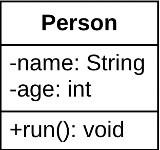
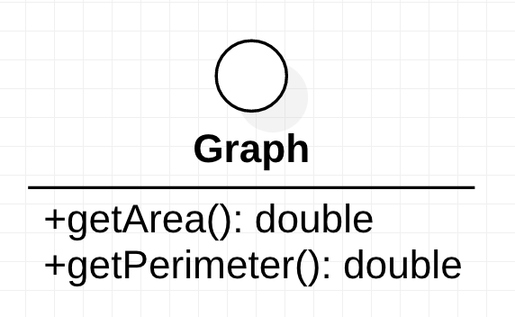
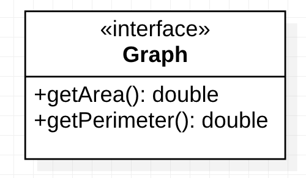
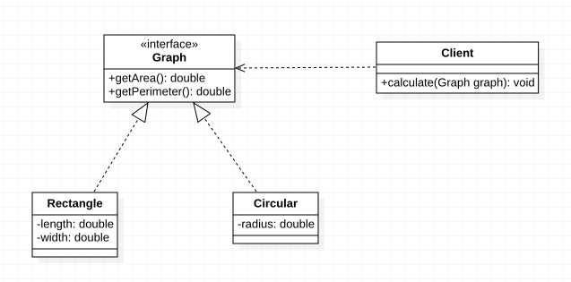
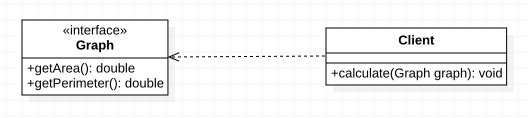
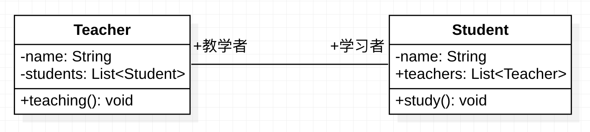
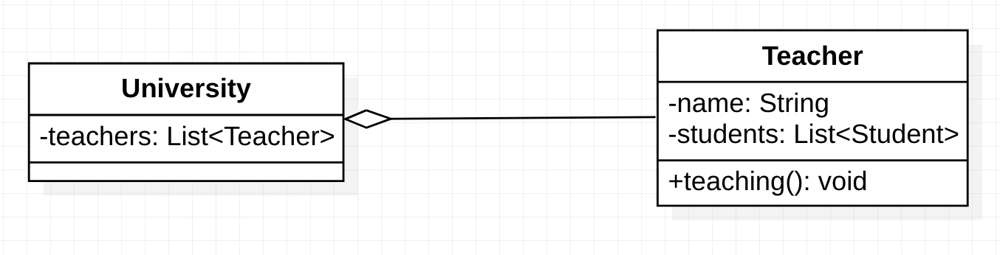
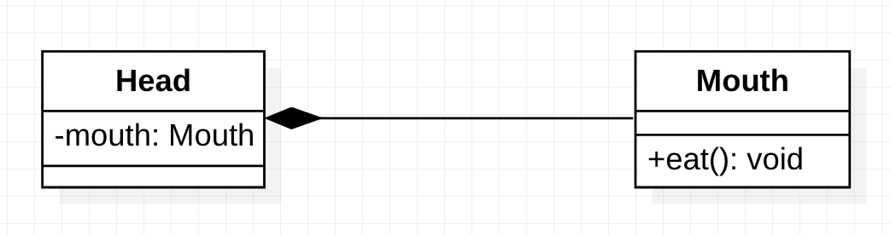
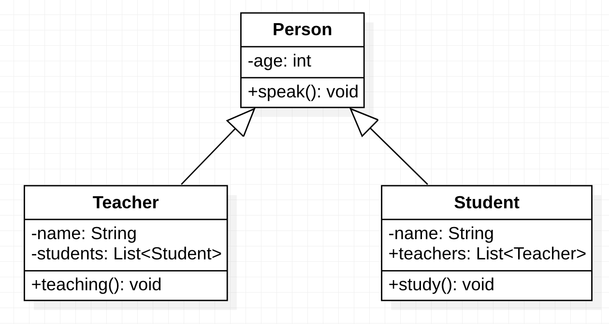
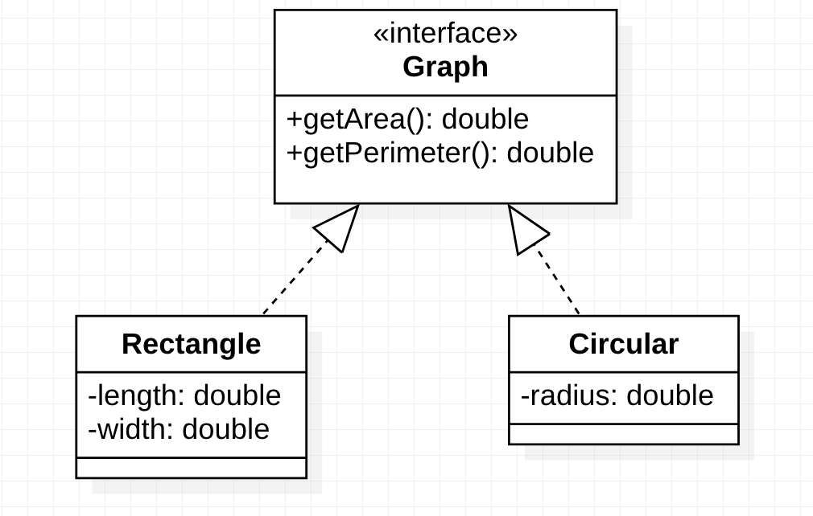

[TOC]


统一建模语言（Unified Modeling Language，UML)是用来设计软件蓝图的可视化建模语言，它的特点是简单、统一、图形化、能表达软件设计中的动态与静态信息。


在学习设计模式的过程中会经常用到UML中的类图，以及类之间的关系。下面介绍类图中的概念。

## 类

***类（Class）*** 是指具有相同属性、方法和关系的对象的抽象，它封装了数据和行为，是面向对象程序设计（OOP）的基础，具有封装性、继承性和多态性。在UML中，类使用包含类名、属性和操作且带有分隔线的矩形来表示。

- ***类名（Name）*** 是一个字符串，例如：Person。

- ***属性（Attribute）*** 是指类的特性，即类的成员变量。表示形式如下：

    `[可见性]属性名：类型[=默认值]` 	

    例如：```-name:String```

- ***操作（Operations）*** 是类的任意一个实例对象都可以使用的行为，是类的成员方法。表示形式如下：

    `[可见性]名称(参数列表)[:返回类型]`

    例如：```+run():void```

`注意：`“可见性”表示该属性对类外的元素是否可见，包括共有（Public）、私有（Private）、受保护（Protected）和朋友（Friendly）四种，在类图中分别用符号`+、-、#、~`表示。


Person类UML表示如下：




## 接口

***接口（Interface）*** 是一种特殊的类，他具有类的结构但不可被实例化，只可以被子类实现。它包含抽象操作，但不包含属性。他描述了类或组件对外可见的动作。在UML中，接口使用一个带有名称的小圆圈进行表示，也可以使用`《interface》`表示。

Graph接口UML表示如下：





## 类图

***类图（Class Diagram）*** 是用来显示系统中的类、接口、协作以及它们之间的静态结构和关系的一种静态模型。它主要用于描述软件系统的结构化设计，帮助人们简化对软件系统的理解。


类图中的类可以通过某种编程语言直接实现。如下所示是“计算长方形和圆形的周长与面积”的类图，图形接口有计算面积和周长的抽象方法，长方形和圆形实现这两个方法供访问类调用。




## 类之间的关系

在软件系统中，类不是孤立存在的，类与类之间存在各种关系。根据类与类之间关系的耦合度从弱到强依次为：依赖关系、关联关系、聚合关系、组合关系、泛化关系和实现关系。其中泛化和实现的耦合度相等，他们是耦合度最强的。

### 依赖关系

***依赖（Dependency）*** 关系是一种使用关系，它是对象之间耦合度最弱的一种关联方式，是临时性的关联。在代码中某个类的方法通过局部变量、方法的参数、方法的返回值或者对静态方法的调用访问另一个类（被依赖类）中的某些方法来完成一些职责。


在UML类图中，依赖关系使用带箭头的虚线来表示，箭头从使用类指向被依赖的类。例如：Client依赖Graph可表示为下图所示。




### 关联关系

***关联（Association）*** 关系是对象之间的一种引用关系，用于表示一类对象与另一类对象之间的联系。如老师和学生、丈夫和妻子等。关联关系是类与类之间最常用的一种关系，分为一般关联关系、聚合关系和组合关系。我们先介绍一般关联关系。


关联关系可以是双向的，也可以是单向的。

- ***双向关联关系*** 用带两个箭头或者没有箭头的实现来表示。
- ***单向关联关系*** 用带一个箭头的实现来表示。

箭头从使用类指向被关联的类。可以在关联线的两端标注角色名，代表两种不同的角色。


在代码中通常将一个类的对象作为另一个类的成员变量来实现关联关系。如下图所示是老师和学生的关系图，每个老师可以教多个学生，每个学生也可以有多个老师，他们是双向关联。




### 聚合关系

***聚合（Aggregation）*** 关系是关联关系的一种，是强关联关系，是整体和部分之间的关系，是`has-a`的关系。


聚合关系也是通过成员对象来实现的，其中成员对象是整体对象的一部分，但是成员对象可以脱离整体对象而独立存在。例如，学校与老师的关系，学校包含老师，但如果学校停办了，老师依然存在。


在UML类图中，聚合关系可以用带空心菱形的实线来表示，菱形指向整体。如下图所示大学和老师的关系图：




### 组合关系

***组合（Composition）*** 关系也是关联关系的一种，也表示类之间的整体与部分的关系，但它是一种更强烈的聚合关系，是`contains-a`关系。


在组合关系中，整体对象可以控制部分对象的生命周期，一旦整体对象不存在，部分对象也将不存在，部分对象不能脱离整体对象而存在。例如，头和嘴的关系，没有了头，嘴也就不存在了。


在UML类图中，组合关系用带实心菱形的实线来表示，菱形指向整体。如下图所示是头和嘴的关系图。




### 泛化关系

***泛化（Generalization）*** 关系是对象之间耦合度最大的一种关系，表示一般与特殊的关系，是父类与子类之间的关系，是一种继承关系，是`is-a`的关系。


在UML类图中，泛化关系用带空心三角形箭头的实线来表示，箭头从子类指向父类。在代码实现时，使用面向对象的继承机制来实现泛化关系。例如，Student类和Teacher类都是Person类的子类，如下图所示。




### 实现关系

***实现（Realization）*** 关系是接口与实现类之间的关系。在这种关系中，类实现了接口，类中的操作实现了接口中所声明的所有的抽象操作。


在UML类图中，实现关系使用带空心三角箭头的虚线来表示，箭头从实现类指向接口。例如，下图所示矩形和圆形实现了图形。




