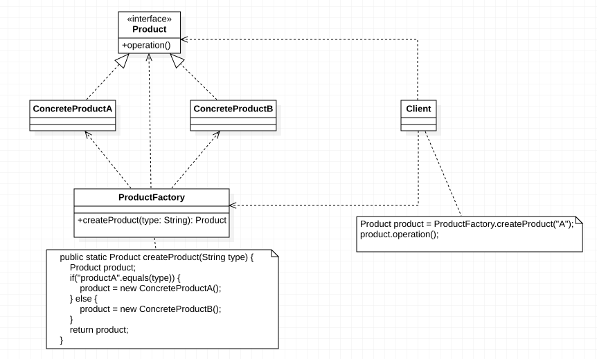

`简单工厂模式`并不属于GoF 23种经典设计模式，但通常将作为学习其他工厂模式的基础，在实际开发中使用频率也非常高。其定义如下：


***简单工厂模式（Simple Factory Pattern）：*** 定义一个工厂类，它可以根据参数的不同返回不同类的实例，被创建的实例通常都具有共同的父类。因为在简单工厂模式中用于创建实例的方法是静态方法，因此简单工厂模式又被称为`静态工厂方法（Static Factory Method）`模式，它属于创建类型模式。


首先我们要知道与一个对象相关的职责通常分为三种：

- ***对象本身所具有的职责：*** 即对象本身所具有的一些数据和行为，可以通过一些公开的方法来实现它的职责。
- ***创建对象的职责：*** 在Java中，通常有以下几种创建对象的方式：
    - 使用`new`关键字直接创建对象；
    - 通过反射机制创建对象；
    - 通过`clone()`方式创建对象；
    - 通过工厂类创建对象。
- ***使用对象的职责：*** 即客户端调用对象公开的方法。


在`工厂模式`中，我们都强调一点：***两个类A和B之间的关系应该仅仅是A创建B或A使用B，而不能两种关系都有。*** `对象的创建和使用分离`，也使得系统更加符合[`单一职责原则`](./单一职责原则.md)，有利于对功能的复用和系统的维护。


对象的创建和使用分离有如下好处：

- 防止用来实例化一个类的数据和代码在多个类中到处都是，可以将有关创建的代码封装到一个工厂类中。
- 可以提供一系列名字完全不同的工厂方法，每一个工厂方法对应一个构造函数。这样更容易理解不同构造函数的作用和用途。


在了解了以上内容之后我们在来看看如何实现简单工厂模式：




```java
// 产品接口
public interface Product {
    public void operation();
}

// 具体产品A
public class ConcreteProductA implements Product {
    @Override
    public void operation() {
        System.out.println("ConcreteProductA >>> operation()");
    }
}

// 具体产品B
public class ConcreteProductB implements Product {
    @Override
    public void operation() {
        System.out.println("ConcreteProductB >>> operation()");
    }
}

// 产品工厂
public class ProductFactory {
		// 工厂方法
    public static Product createProduct(String type) {
        Product product;
        if("productA".equals(type)) {
            product = new ConcreteProductA();
        } else {
            product = new ConcreteProductB();
        }
        return product;
    }
}

public static void main(String[] args) {
  	// 使用工厂方法创建产品
    Product product = ProductFactory.createProduct("productA");
    product.operation();
}
```


以上则是简单工厂的典型实现方式。


在简单工厂模式中包含如下几个角色：

- ***Factory（工厂角色）：*** 工厂角色及工厂类，例如代码中的`ProductFactory`，它是简单工厂模式的核心，负责实现创建所有产品实例；工厂类可以被外界直接调用，创建所需的产品对象；在工厂类中提供了静态的工厂方法`createProduct()`，它的返回类型为抽象产品类型`Product`。
- ***Product（抽象产品角色）：*** 它是工厂类所创建的所有对象的父类，封装了各种产品对象的公共方法，它的引入将提高系统的灵活性，使得在工厂类中只需要定义一个通用的工厂方法即可，因为所有创建的具体产品对象都是其子类对象。
- ***ConcreteProduct（具体产品角色）：*** 它是简单工厂模式的创建目标，是具体的实现类，每一个`具体产品角色`都继承了`抽象产品角色`，需要实现在`抽象产品`中声明的抽象方法。


在简单工厂模式中，客户端通过工厂类来创建一个产品类的实例，而无须直接使用`new`关键字来创建对象，它是工厂模式家族中最简单的一种。


`简单工厂模式`提供了专门的工厂类用于创建对象，将对象的创建和对象的使用分离开，它作为一种最简单的工厂模式在软件开发中得到了较为广泛的应用。

`简单工厂模式`的主要优点如下：

- 工厂类包含必要的判断逻辑，可以决定在什么时候创建哪一个产品类的实例，客户端可以免除直接创建产品对象的职责，而仅仅”消费“产品，简单工厂模式实现了对象创建和使用的分离。
- 客户端无须知道所创建的具体产品类的类名，只需要知道具体产品类所对应的参数即可，对于一些复杂的类名，通过简单工厂模式可以在一定程度减少使用者的记忆量。
- 通过引入配置文件，可以在不修改任何客户端代码的情况下更换和增加新的具体产品类，在一定程度上提高了系统的灵活性。


`简单工厂模式`的主要缺点如下：

- 由于工厂类集中了所有产品的创建逻辑，职责过重，一旦不能正常工作则整个系统都要受到影响。
- 使用简单工厂模式势必会增加系统中类的数量，增加了系统的负责度和理解难度。
- 系统扩展困难，一旦添加新产品就不得不修改工厂逻辑，在产品类型较多时，有可能造成工厂逻辑过于复杂，不利于系统的扩展和维护。
- 简单工厂模式由于使用了静态工厂方法，造成工厂角色无法形成基于继承的等级结构。


对于产品种类相对较少的情况，考虑使用简单工厂模式。使用简单工厂模式的客户端只需要传入工厂类的参数，不需要关心如何创建对象的逻辑，可以很方便地创建所需产品。


 

