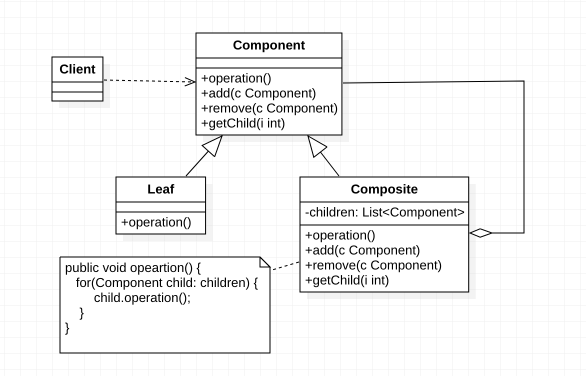

# 组合模式定义


> ***组合模式（Composite Pattern）：*** 组合多个对象行程属性结构以表示具有`整体——部分`关系的层次结构。组合模式对单个对象（即叶子对象）和组合对象（即容器对象）的使用具有一致性，组合模式又可以称为`整体——部分（Part-Whole）模式`，它是一种对象结构型模式。


在组合模式中引入了抽象构件类`Component`，它是所有容器类和叶子类的公共父类，客户端针对`Component`进行编程。组合模式结构如下所示：




在组合模式结构图中包含如下几个角色：

- ***Component（抽象构件）***：它可以是接口或抽象类，为叶子构件和容器构件对象声明接口，在该角色中可以包含所有子类共有行为的声明和实现。在抽象构件中定义了访问及管理它的子构件的方法，如增加子构件、删除子构件、获取子构件等。

- ***Leaf（叶子构件）*** ：它在组合结构中表示叶子节点对象，叶子节点没有子节点，它实现了在抽象构件中定义的行为。对于那些访问及管理子构件的方法，可以通过异常等方式进行处理。

- ***Composite（容器构件）***：它在组合结构中表示容器节点对象，容器节点包含子节点，其子节点可以是叶子节点，也可以是容器节点，它提供一个集合用于存储子节点，实现了在抽象构件中定义的行为，包括那些访问及管理子构件的方法，在其业务方法中可以递归调用其子节点的业务方法。


***\组合模式的关键是定义了一个抽象构件类，它既可以代表叶子，又可以代表容器，而客户端针对该抽象构件类进行编程，无须知道它到底表示的是叶子还是容器，可以对其进行统一处理。\***同时容器对象与抽象构件类之间还建立一个聚合关联关系，在容器对象中既可以包含叶子，也可以包含容器，以此实现递归组合，形成一个树形结构。


# 组合模式代码实现

组合模式典型代码实现如下：

```java
/**
 * 抽象构件
 */
public abstract class Component {

    // 增加成员
    public abstract void add(Component c);
    // 删除成员
    public abstract void remove(Component c);
    // 获取成员
    public abstract Component getChild(int i); 
    // 业务方法
    public abstract void operation();

}


/**
 * 叶子构件
 */
public class Leaf extends Component {

    private String name;

    public Leaf(String name) {
        this.name = name;
    }

    @Override
    public void add(Component c) {
        //异常处理或错误提示
    }

    @Override
    public void remove(Component c) {
        //异常处理或错误提示
    }

    @Override
    public Component getChild(int i) {
        return null;
    }

    @Override
    public void operation() {
        //叶子构件具体业务方法的实现
        System.out.println("执行叶子-" + name + "构件业务方法！");
    }
}

/**
 * 容器构件
 */
public class Composite extends Component {

    private List<Component> children = new ArrayList<>();

    @Override
    public void add(Component c) {
        children.add(c);
    }

    @Override
    public void remove(Component c) {
        children.remove(c);
    }

    @Override
    public Component getChild(int i) {
        return children.get(i);
    }

    @Override
    public void operation() {
        for (Component child: children) {
            child.operation();
        }
    }
}

public static void main(String[] args) {
    Component l1 = new Leaf("l1");
    Component l2 = new Leaf("l2");
    Component l3 = new Leaf("l3");

    Component c1 = new Composite();
    c1.add(l1);
    c1.add(l2);

    Component c2 = new Composite();
    c2.add(l3);

    Component c3 = new Composite();
    c3.add(c1);
    c3.add(c2);
    c3.operation();
}
```


# 透明组合模式与安全组合模式

##  透明方式

在该方式中，由于抽象构件声明了所有子类中的全部方法，所以客户端无须区别树叶对象和树枝对象，对客户端来说是透明的。但其缺点是：树叶构件本来没有 `add()`、`remove()` 及 `getChild()` 方法，却要实现它们（空实现或抛异常），这样会带来一些安全性问题。


## 安全模式

在该方式中，将管理子构件的方法移到树枝构件中，抽象构件和树叶构件没有对子对象的管理方法，这样就避免了上一种方式的安全性问题，但由于叶子和分支有不同的接口，客户端在调用时要知道树叶对象和树枝对象的存在，所以失去了透明性。


# 组合模式总结

  组合模式使用面向对象的思想来实现树形结构的构建与处理，描述了如何将容器对象和叶子对象进行递归组合，实现简单，灵活性好。


## 主要优点

组合模式的主要优点如下：

1. 组合模式可以清楚地定义分层次的复杂对象，表示对象的全部或部分层次，它让客户端忽略了层次的差异，方便对整个层次结构进行控制。

2. 客户端可以一致地使用一个组合结构或其中单个对象，不必关心处理的是单个对象还是整个组合结构，简化了客户端代码。
3. 在组合模式中增加新的容器构件和叶子构件都很方便，无须对现有类库进行任何修改，符合“开闭原则”。
4. 组合模式为树形结构的面向对象实现提供了一种灵活的解决方案，通过叶子对象和容器对象的递归组合，可以形成复杂的树形结构，但对树形结构的控制却非常简单。


## 主要缺点

组合模式的主要缺点如下：

1. 设计较复杂，客户端需要花更多时间理清类之间的层次关系；
2. 不容易限制容器中的构件；
3. 不容易用继承的方法来增加构件的新功能；

## 适用场景

在以下情况下可以考虑使用组合模式：

1. 在具有整体和部分的层次结构中，希望通过一种方式忽略整体与部分的差异，客户端可以一致地对待它们。
2. 在一个使用面向对象语言开发的系统中需要处理一个树形结构。
3. 在一个系统中能够分离出叶子对象和容器对象，而且它们的类型不固定，需要增加一些新的类型。