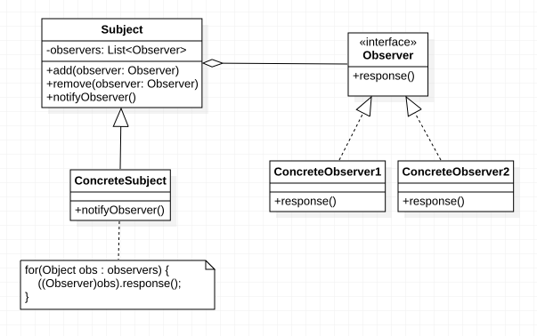

### 观察者定义


> ***观察者模式（Observer Pattern）：*** 定义对象之间的一种一对多依赖关系，使得每当一个对象状态发生变化改变时，其相关依赖对象皆可得到通知并被自动更新。观察者模式的别名包括***发布-订阅（Publish/Subscribe）模式***、***模型-视图（Model/View）模式***、***源-监听器（Source/Listener）模式*** 或 ***从属者（Dependents）模式***。观察者模式是一种对象行为型模式。


### 观察者架构

观察者模式结构中通常包含观察目标和观察者两个继承层次结构，其结构图如下：





在观察者模式结构图中包含如下几个角色：

- ***目标类（Subject）：*** 目标又称为主题，它是指被观察的对象。在目标中定义了一个观察者集合，一个观察者目标可以接受任意数量的观察者来观察，它提供一系列方法来增加和删除观察者对象，同时定义了通知方法`notify()`。目标类可以是接口，也可以是抽象类或具体类。
- ***具体目标（ConcreteSubject）：*** 具体目标是目标类的子类，通常它包含有经常发生改变的数据，当它状态发生变化时，向它的各个观察者发出通知；同时它还实现了在目标类中定义的抽象业务逻辑方法（如果有的话）如果无须扩展目标类，则具体目标类可以省略。
- ***观察者（Observer）：*** 观察者将对观察目标的改变做出反应，观察者一般定义为接口，该接口声明了更新数据的方法`update()`，因此又称为抽象观察者。
- ***具体观察者（ConcreteObserver）：*** 具体观察者实现了抽象观察者 `Observer`中定义的`update()`方法。通常在实现时，可以调用具体目标类的`add()`方法将自己添加到目标类的集合中或通过`remove()`方法将自己从目标类的集合中删除。

***\观察者模式描述了如何建立对象与对象之间的依赖关系，以及如何构造满足这种需求的系统。\***观察者模式包含观察目标和观察者两类对象，一个目标可以有任意数目的与之相依赖的观察者，一旦观察目标的状态发生改变，所有的观察者都将得到通知。作为对这个通知的响应，每个观察者都将监视观察目标的状态以使其状态与目标状态同步，这种交互也称为发布-订阅(Publish-Subscribe)。观察目标是通知的发布者，它发出通知时并不需要知道谁是它的观察者，可以有任意数目的观察者订阅它并接收通知。


### 观察者代码实现

观察者典型代码实现如下：


```java

/**
 * 抽象目标类
 */
public abstract class Subject {

    protected List<Observer> observers = new ArrayList<>();

    /**
     * 添加观察者方法
     */
    public void add(Observer observer) {
        observers.add(observer);
    }

    /**
     * 删除观察者方法
     */
    public void remove(Observer observer) {
        observers.remove(observer);
    }

    /**
     * 通知观察者方法
     */
    public abstract void notifyObserver();
}


/**
 * 具体目标类
 */
public class ConcreteSubject extends Subject {
    @Override
    public void notifyObserver() {
        // 通知每一个观察者状态变更
        for (Observer obs: observers) {
            obs.response();
        }
    }
}

/**
 * 抽象观察者
 */
public interface Observer {
    void response();
}

/**
 * 具体观察者 1
 */
public class ConcreteObserver1 implements Observer {
    @Override
    public void response() {
        System.out.println("具体观察者 1 做出反应！");
    }
}

/**
 * 具体观察者 2
 */
public class ConcreteObserver2 implements Observer {
    @Override
    public void response() {
        System.out.println("具体观察者 2 做出反应！");
    }
}

public static void main(String[] args) {
    // 观察者的使用
    Subject subject = new ConcreteSubject();
    Observer observer1 = new ConcreteObserver1();
    Observer observer2 = new ConcreteObserver2();
    subject.add(observer1);
    subject.add(observer2);
    subject.notifyObserver();
}

```


在 JDK 中提供了对观察者模式的支持，可参考`java.util.Observable`、`java.util.Observer`两个类。


### 观察者总结

观察者模式是一种使用频率非常高的设计模式，无论是移动应用、Web应用或者桌面应用，观察者模式几乎无处不在，它为实现对象之间的联动提供了一套完整的解决方案，凡是涉及到一对一或者一对多的对象交互场景都可以使用观察者模式。

   ***1.主要优点***

   观察者模式的主要优点如下：

   (1) 观察者模式可以实现表示层和数据逻辑层的分离，定义了稳定的消息更新传递机制，并抽象了更新接口，使得可以有各种各样不同的表示层充当具体观察者角色。

   (2) 观察者模式在观察目标和观察者之间建立一个抽象的耦合。观察目标只需要维持一个抽象观察者的集合，无须了解其具体观察者。由于观察目标和观察者没有紧密地耦合在一起，因此它们可以属于不同的抽象化层次。

   (3) 观察者模式支持广播通信，观察目标会向所有已注册的观察者对象发送通知，简化了一对多系统设计的难度。

   (4) 观察者模式满足“开闭原则”的要求，增加新的具体观察者无须修改原有系统代码，在具体观察者与观察目标之间不存在关联关系的情况下，增加新的观察目标也很方便。

   ***2.主要缺点***

   观察者模式的主要缺点如下：

   (1) 如果一个观察目标对象有很多直接和间接观察者，将所有的观察者都通知到会花费很多时间。

   (2) 如果在观察者和观察目标之间存在循环依赖，观察目标会触发它们之间进行循环调用，可能导致系统崩溃。

   (3) 观察者模式没有相应的机制让观察者知道所观察的目标对象是怎么发生变化的，而仅仅只是知道观察目标发生了变化。

   ***3.适用场景***

   在以下情况下可以考虑使用观察者模式：

   (1) 一个抽象模型有两个方面，其中一个方面依赖于另一个方面，将这两个方面封装在独立的对象中使它们可以各自独立地改变和复用。

   (2) 一个对象的改变将导致一个或多个其他对象也发生改变，而并不知道具体有多少对象将发生改变，也不知道这些对象是谁。

   (3) 需要在系统中创建一个触发链，A对象的行为将影响B对象，B对象的行为将影响C对象……，可以使用观察者模式创建一种链式触发机制。

