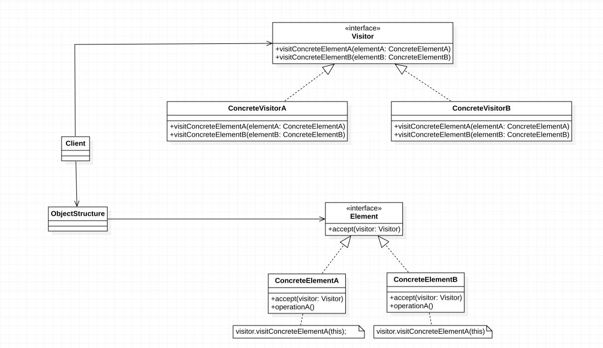

> ***访问者模式（Visitor Pattern）：*** 提供一个作用于对象结构中的各元素的操作表示，它使我们可以在不改变各元素的类的前提下定义作用于这些元素的新操作。访问者模式是一种对象行为型模式。


访问者模式的结构较为复杂，其结构如下图所示：




在访问者模式结构图中包含如下几个角色：

- ***Vistor（抽象访问者）***：抽象访问者为对象结构中每一个具体元素类ConcreteElement声明一个访问操作，从这个操作的名称或参数类型可以清楚知道需要访问的具体元素的类型，具体访问者需要实现这些操作方法，定义对这些元素的访问操作。

- ***ConcreteVisitor（具体访问者）***：具体访问者实现了每个由抽象访问者声明的操作，每一个操作用于访问对象结构中一种类型的元素。

- ***Element（抽象元素）***：抽象元素一般是抽象类或者接口，它定义一个accept()方法，该方法通常以一个抽象访问者作为参数。【稍后将介绍为什么要这样设计。】

- ***ConcreteElement（具体元素）***：具体元素实现了accept()方法，在accept()方法中调用访问者的访问方法以便完成对一个元素的操作。

- ***ObjectStructure（对象结构）***：对象结构是一个元素的集合，它用于存放元素对象，并且提供了遍历其内部元素的方法。它可以结合组合模式来实现，也可以是一个简单的集合对象，如一个List对象或一个Set对象。

访问者模式中对象结构存储了不同类型的元素对象，以供不同访问者访问。访问者模式包括两个层次结构，一个是访问者层次结构，提供了抽象访问者和具体访问者，一个是元素层次结构，提供了抽象元素和具体元素。相同的访问者可以以不同的方式访问不同的元素，相同的元素可以接受不同访问者以不同访问方式访问。在访问者模式中，增加新的访问者无须修改原有系统，系统具有较好的可扩展性。

在访问者模式中，抽象访问者定义了访问元素对象的方法，通常为每一种类型的元素对象都提供一个访问方法，而具体访问者可以实现这些访问方法。这些访问方法的命名一般有两种方式：一种是直接在方法名中标明待访问元素对象的具体类型，如visitElementA(ElementA elementA)，还有一种是统一取名为visit()，通过参数类型的不同来定义一系列重载的visit()方法。当然，如果所有的访问者对某一类型的元素的访问操作都相同，则可以将操作代码移到抽象访问者类中，其典型代码如下所示：


```java
abstract class Visitor {
	public abstract void visit(ConcreteElementA elementA);
	public abstract void visit(ConcreteElementB elementB);
	public void visit(ConcreteElementC elementC) {
		//元素ConcreteElementC操作代码
	}
}

class ConcreteVisitor extends Visitor {
	public void visit(ConcreteElementA elementA) {
		//元素ConcreteElementA操作代码
	}
    
	public void visit(ConcreteElementB elementB) {
		//元素ConcreteElementB操作代码
	}
}

interface Element {
	public void accept(Visitor visitor);
}


class ConcreteElementA implements Element {
	public void accept(Visitor visitor) {
		visitor.visit(this);
	}
	
	public void operationA() {
		//业务方法
	}
}

class ObjectStructure {
	private ArrayList<Element> list = new ArrayList<Element>(); //定义一个集合用于存储元素对象
 
	public void accept(Visitor visitor) {
		Iterator i=list.iterator();
		
		while(i.hasNext()) {
			((Element)i.next()).accept(visitor); //遍历访问集合中的每一个元素
		}
	}
 
	public void addElement(Element element) {
		list.add(element);
	}
 
	public void removeElement(Element element) {
		list.remove(element);
	}
}

```


# 访问者模式总结

由于访问者模式的使用条件较为苛刻，本身结构也较为复杂，因此在实际应用中使用频率不是特别高。当系统中存在一个较为复杂的对象结构，且不同访问者对其所采取的操作也不相同时，可以考虑使用访问者模式进行设计。在XML文档解析、编译器的设计、复杂集合对象的处理等领域访问者模式得到了一定的应用。


## 主要优点

访问者模式的主要优点如下：

1. 增加新的访问操作很方便。使用访问者模式，增加新的访问操作就意味着增加一个新的具体访问者类，实现简单，无须修改源代码，符合“开闭原则”。

2. 将有关元素对象的访问行为集中到一个访问者对象中，而不是分散在一个个的元素类中。类的职责更加清晰，有利于对象结构中元素对象的复用，相同的对象结构可以供多个不同的访问者访问。

3. 让用户能够在不修改现有元素类层次结构的情况下，定义作用于该层次结构的操作。


## 主要缺点

访问者模式的主要缺点如下：

1. 增加新的元素类很困难。在访问者模式中，每增加一个新的元素类都意味着要在抽象访问者角色中增加一个新的抽象操作，并在每一个具体访问者类中增加相应的具体操作，这违背了“开闭原则”的要求。

2. 破坏封装。访问者模式要求访问者对象访问并调用每一个元素对象的操作，这意味着元素对象有时候必须暴露一些自己的内部操作和内部状态，否则无法供访问者访问。


## 适用场景

在以下情况下可以考虑使用访问者模式：

1. 一个对象结构包含多个类型的对象，希望对这些对象实施一些依赖其具体类型的操作。在访问者中针对每一种具体的类型都提供了一个访问操作，不同类型的对象可以有不同的访问操作。

2. 需要对一个对象结构中的对象进行很多不同的并且不相关的操作，而需要避免让这些操作“污染”这些对象的类，也不希望在增加新操作时修改这些类。访问者模式使得我们可以将相关的访问操作集中起来定义在访问者类中，对象结构可以被多个不同的访问者类所使用，将对象本身与对象的访问操作分离。

3. 对象结构中对象对应的类很少改变，但经常需要在此对象结构上定义新的操作。

