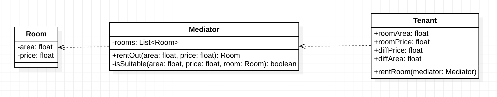

## 迪米特法则的定义

***迪米特法则（Law of Demeter,LoD）：*** 又叫作***最少知道原则（Least Knowledge Principle，LKP)*** 一个软件实体应当尽可能少地与其他实体发生相互作用。

迪米特法则要求软件实体应当只与直接朋友交谈，不与“陌生人”通信。其含义是：如果两个软件实体无须直接通信，那么就不应当发生直接的相互调用，可以通过第三方中介类进行交互。其目的是降低类之间的耦合度，提高模块的相对独立性。

迪米特法则中的“朋友”包含以下几类：

- 当前对象本身（this）；
- 以参数形式传入到当前对象方法中的对象；
- 当前对象的成员对象；
- 如果当前对象的成员对象是一个集合，那么集合中的元素也都是朋友；
- 当前对象所创建的对象。

这些对象同当前对象存在关联、聚合或者组合关系，可以直接访问这些对象的方法。

## 迪米特法则的优点

迪米特法则要求限制软件实体之间通信的宽度和深度，正确使用迪米特法则将有以下两个优点。

1. 降低了类之间的耦合度，提高了模块的相对独立性。
2. 由于亲合度降低，从而提高了类的可复用率和系统的扩展性。

但是，过度使用迪米特法则会使系统产生大量的中介类，从而增加系统的复杂性，使模块之间的通信效率降低。所以，在釆用迪米特法则时需要反复权衡，确保高内聚和低耦合的同时，保证系统的结构清晰。

`洞洞幺`最近租的房子到期了，但是由于工作太忙天天加班没有时间出去找房子，所以找了中介，`洞洞幺`把对房子的要求告诉中介之后就可以安心的加班了，中介找到合适的房子后就会告诉`洞洞幺`。如下图所示：

可以看出在整个找房子的过程租户把要求都告诉给中介者，所以整根过程租户并不需要与房子产生关系，所有的工作都交给中介者去完成，这样就解耦了房源和租户，`Tenant`只需要和他的”朋友“`Mediator`进行交流即可。对于`Tenant`来说房东、维修师傅等这些角色都不是他的”朋友“，所以`Tenant`只与直接朋友`Mediator`通信即可，这样就可以从复杂的关系网中抽离出来，是程序耦合度更低、稳定性更好。

