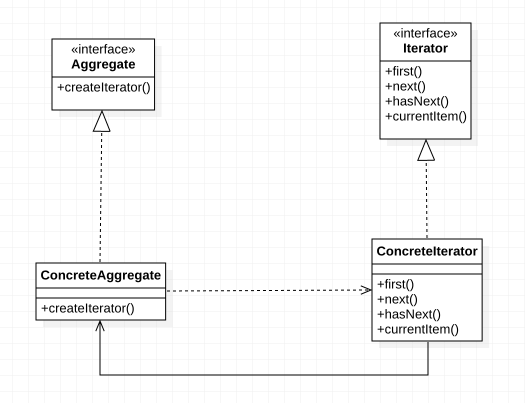

# 迭代器模式定义

> ***迭代器模式（Iterator Pattern）：*** 提供一种方法来访问聚合对象，而不用暴露这个对象的内部表示，其别名为游标（Cursor）。迭代器模式是一种对象行为型模式。

在软件开发中，我们经常需要使用聚合对象来存储一系列数据。聚合对象拥有两个职责：一是***存储数据***；二是***遍历数据***。从依赖性来看，前者是聚合对象的基本职责；而后者既是可变化的，又是可分离的。因此，可以将遍历数据的行为从聚合对象中分离出来，封装在一个被称之为“迭代器”的对象中，由迭代器来提供遍历聚合对象内部数据的行为，这将简化聚合对象的设计，更符合“单一职责原则”的要求。

# 迭代器模式结构

在迭代器模式结构中包含聚合和迭代器两个层次结构，考虑到系统的灵活性和可扩展性，***在迭代器模式中应用了工厂方法模式***，其模式结构如下图所示：

