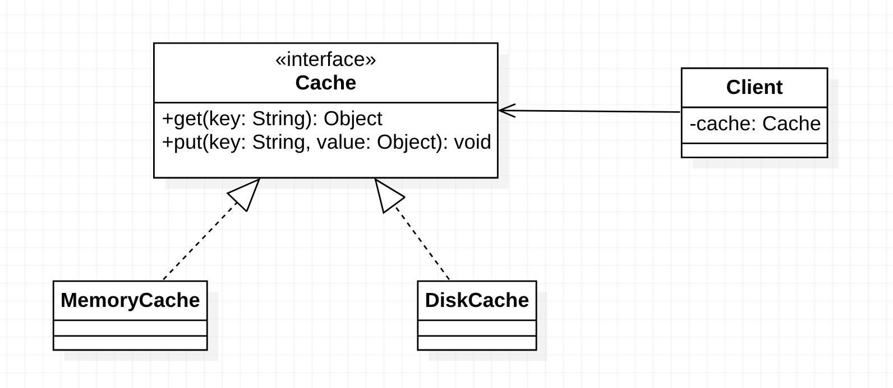

[TOC]

## 开闭原则

***开闭原则（Open Closed Principle，OCP)*** 即`软件实体应当对扩展开放，对修改关闭`。

所谓的软件实体可以是项目中划分出的模块、类与接口、方法等。

即当应用的需求改变时，在补修改软件实体的源代码或者二进制代码的前提下，可以扩展模块的功能，使其满足新的需求。

### 开闭原则的作用

开闭原则是面向对象程序设计的终极目标，它使软件实体拥有一定的适应性和灵活性的同时具备稳定性和延续性。具体来说，其作用如下：

1. 对软件测试的影响

   当软件遵守开闭原则时，在软件测试时只需要对扩展的代码进行测试就可以了，因为原有的测试代码仍然能够正常运行。

2. 可以提高代码的可复用性

   力度越小，被复用的可能性就越大；在面向对象的程序设计中，根据原子和抽象编程可以提高代码的可复用性。

3. 可以提高软件的可维护性

   遵守开闭原则的软件，其稳定性高、延续性强，从而易于扩展和维护。

### 开闭原则的实现方法

可以通过`抽象约束、封装变化`来实现开闭原则，及通过接口或抽象类为软件实体定义一个相对稳定的抽象层，而将相同的可变因素封装在相同的具体实现类中。

因为抽象灵活性好，适应性强，只要抽象的合理，可以基本保持软件架构的稳定性。而软件中易变的细节可以从抽象派生来的实现类来进行扩展，当软件需要发生变化时，只需要根据需求重新派生一个实现类来扩展就可以了。

例如缓存功能的设计如下图所示：

客户端针对Cache接口编程，当需求从内存缓存转换成磁盘缓存后客户端的代码也不受影响，不需要修改源代码即可完成，所以满足了开闭原则。

## 里氏替换原则

***里氏替换原则（Liskov Substitution Principle, LSP)*** 即`所有引用基类（父类）的地方必须能透明地使用其子类的对象`

通俗的讲就是在软件中将一个基类对象替换成它的子类对象，程序不会产生任何错误和异常，反过来则不成立，如果一个软件实体使用的是一个子类对象的话，那么它不一定能够使用基类对象。

例如：我喜欢动物，那我一定喜欢狗，因为狗是动物的子类；但是我喜欢狗，则不能据此判断我一定喜欢动物。

里氏替换原则是实现开闭原则的重要方式之一，由于使用基类对象的地方都可以使用子类对象，因此在程序中尽量使用基类类型来对对象进行定义，儿在运行时在确定其子类类型，用子类对象来替换父类对象。

### 里氏替换原则的作用

1. 里氏替换原则是实现开闭原则的重要方式之一。
2. 它克服了继承中重写父类造成的可复用性变差的缺点。
3. 它是动作正确性的保证。即类的扩展不会给已有的系统引入新的错误，降低了代码出错的可能性。
4. 加强程序的健壮性，当需求变更时也可以做到非常好的兼容性，提高程序的维护性、扩展性，降低需求变更时引入的风险。

### 里氏替换原则的实现方法

里氏替换原则通俗来讲就是：子类可以扩展父类的功能，但不能改变父类原有的功能。也就是说：子类继承父类时，除添加新的方法完成新增功能外，尽量不要重写父类的方法。

